### Slots 

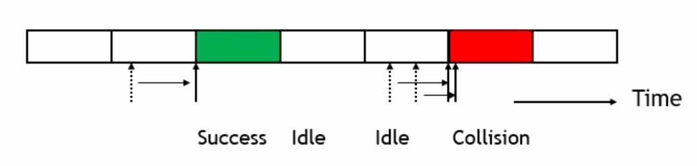

* A slot is either Idle, Success or Collision
  * Idle : No arrival during the previous slot time
  * Success : Exactly one arrival
  * Collision : More than one arrival

#### Wireless Characteristics

* Signal quality of wireless links is much worse than that of wired links

* Rout cause : Attenuation of wireless medius is 
  *  

#### IEEE 802.11 WLAN Standard

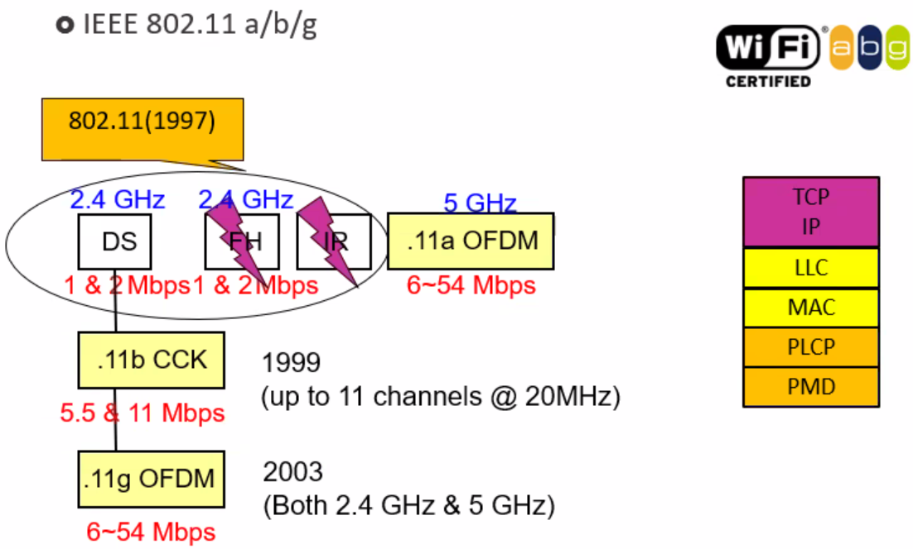

* Transmission Rates

  * AMC: Adaptive Modulation & Coding

  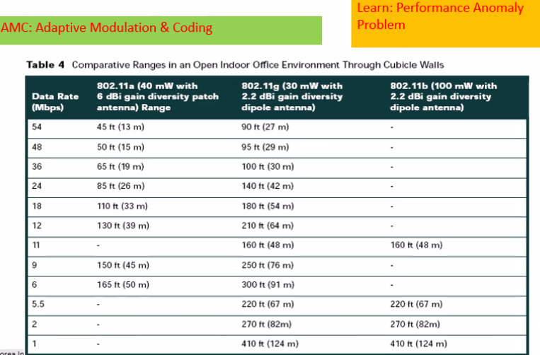

#### Topology

* Infrastructure Mode
  * all packets pass through the **Access Point (AP)**
  * No direct communications between **Mobile Stations (MS**, or client/host)
* Ad-hoc mode
  * Peer-to-peer (station-to-station) direct communications

#### 802.11 Architecture

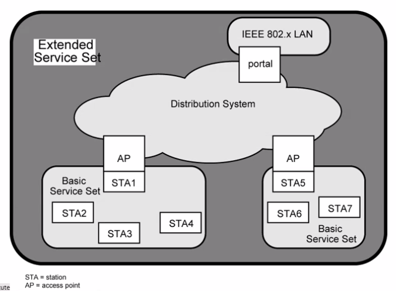

#### Collision Detection

* In wired links, we can be almost sure that a frame is delivered successfully in case of no collision -> ACK is not necessary if CD is equipped

* Wireless CD is impossible

  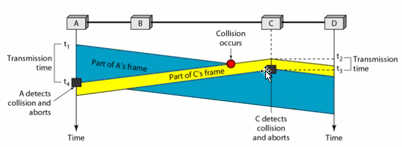

#### Reliability & ACK(acknowledgement code) 응답 코드

1. How do you know a frame is successfully transmitted? => use ACK

   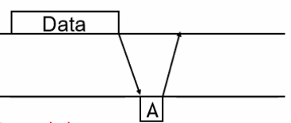

2. No ACK => **Retransmission** 재전송

* ACK should be transmitted before any other framesS

#### Carrier Sensing 매체 사용중 감지 (유 / 무선)

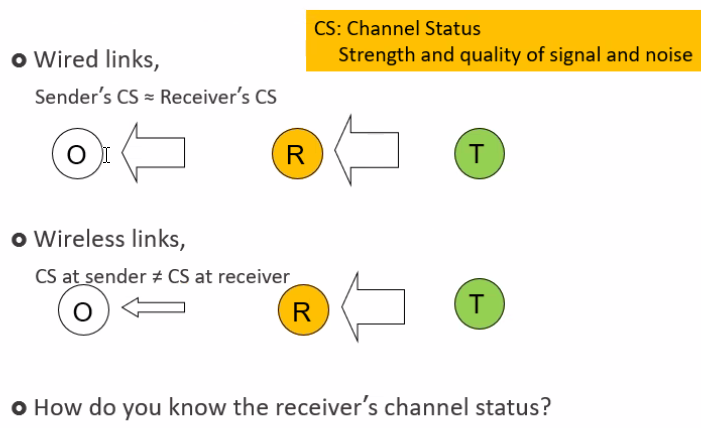

#### Hidden / Exposed Terminal

* **Hidden Terminal** Problem : C cannot sense B->A transmission and attempts to send a frame (더 중요함)
  * 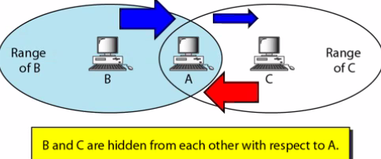
* Exposed Terminal Problem : 
  * C can send to D without disturbing A->B transmission
  * But, C thinks the medium is busy
  * 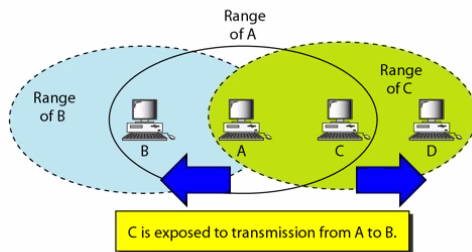

#### RTS/CTS & Virtual CS

* RTS (송신 요구) \- 송신측이 수신측에게 본격적인 데이터를 전송할 의사가 있음을 알리는 신호
* CTS (송신가능) - 수신측이 송신측에게 데이터를 받을 준비가 되어서 전송 허락 신호

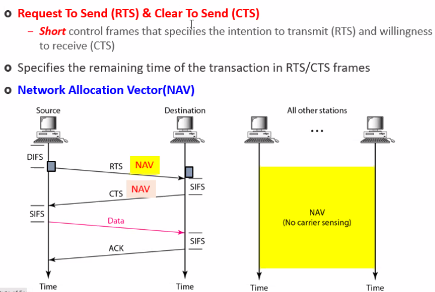

> 송신 노드는 채널이 빈 것(idle)을 알고난 후, DIFS 만큼 기다린 후, RTS 송출
> 수신 노드는 RTS 수신 후, SIFS만큼 기다린 후, CTS 송출
> 송신 노드는 SIFS 만큼 기다린 후, 데이터 송출 시작
> 수신 노드는 SIFS 만큼 기다린 후, 확인응답(ACK) 송출

#### RTS/CTS & Hidden Terminal

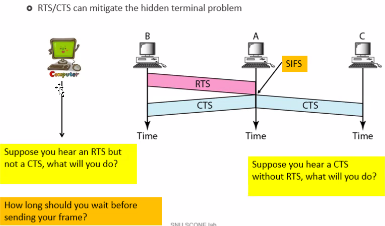

### Atomicity 원자성

> 모두 성공하거나 또는 모두 실패해야함

* DATA & Control frames - ACK, RTS, CTS
* Atomic transaction 
  * Transmissions including both DATA and its ACK
  * RTS-CTS-DATA-ACK
* How to guarantee Atomicity?
  * Use **different CS (Carrier Sense) time**

#### Inter-Frame Space (IFS)

> Importance of ACK > Data
>
> How to prioritize ACK transmission?

* IFS : Minimum time that the medium should be idle to trigger frame transmission
* **SIFS** (short IFS) : For all immediate response actions (CTS, ACK, Poll response)
* **DIFS** (distributed coordination function IFS) : Used as minimum delay for DATA, RTS frames contending for access
* PIFS (point coordinaion function IFS) : Used by the centralized controller in PCF scheme when issuing polls

> If SIFS < DIFS, then data frames cannot intervene DATA-ACK transaction

#### DCF Design

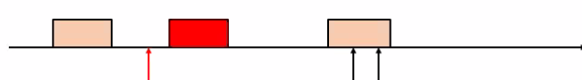

* First Carrier Sensing - A new Data frame arrives and the first Carrier Sensing
* First CS = IDLE - Should wait at least DIFS to protect ACK, CTS and etc
* Fist CS = BUSY - Should wait extra in addition to DIFS 
                            - The extra waiting time should be randomized
* Transmission result - Success or Collision

> In the case of collision, should reduce attempt rate

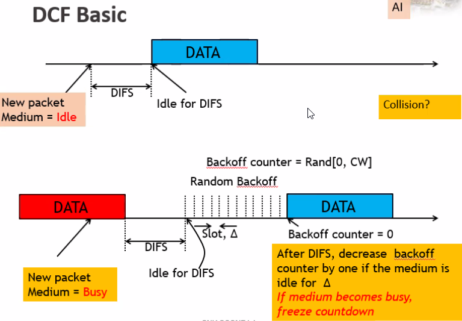

#### BEB (Binary Exp. Backoff)

* Collision = Overloaded

* Contention Window (CW)

* Backoff delay = Random (0 .. CW)

* At the beginning, CW = CW_min

* For each unseccessful transmission, double CW up to CW_max

  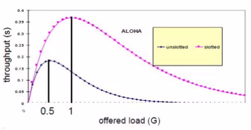

​	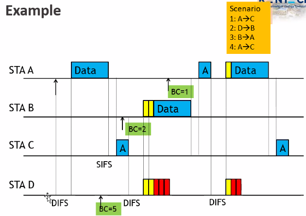

#### DCF - CSMA/CA

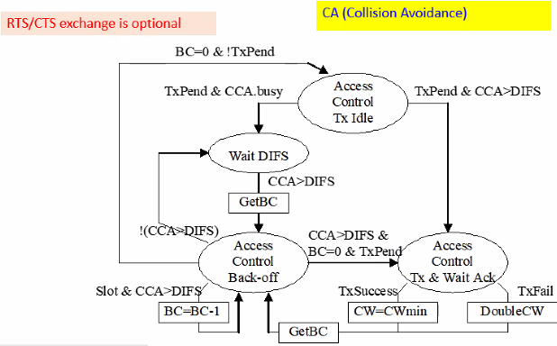