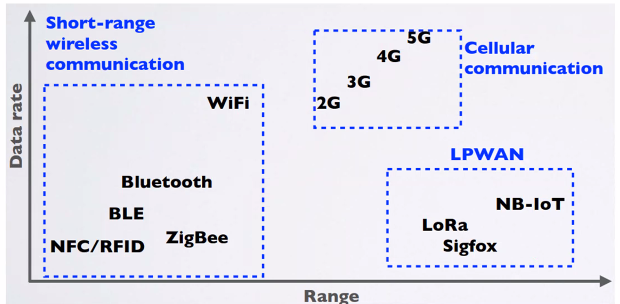
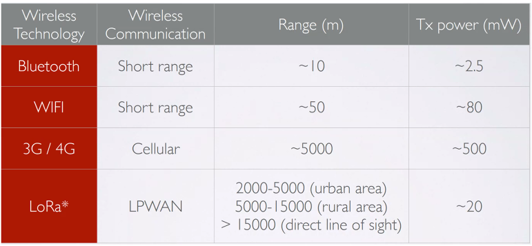
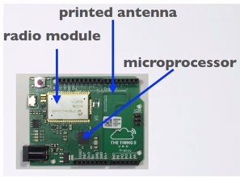
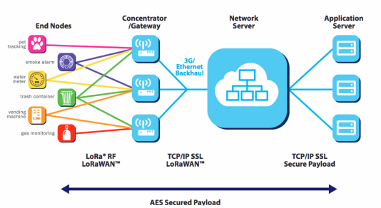
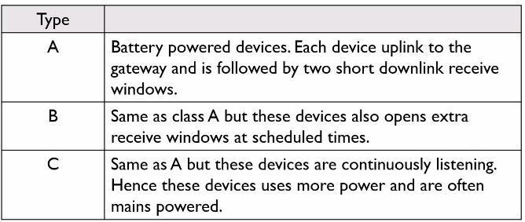
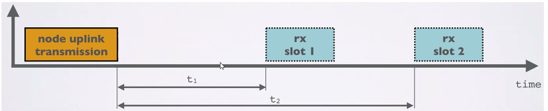
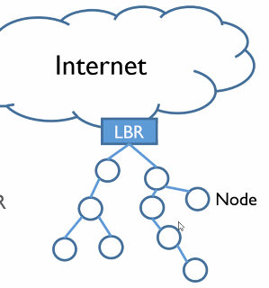
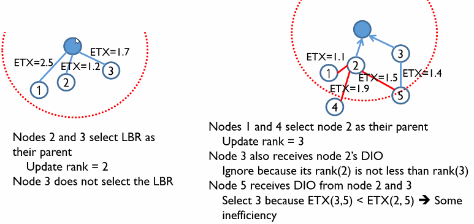
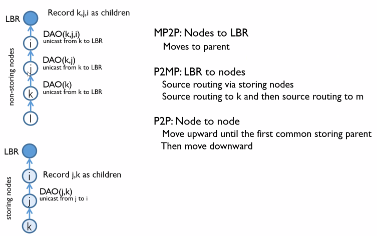

# IOT

#### Internet of Things 사물 인터넷

* The Internet of Things, or IOT is a network of physical devices that are connected to the Internet and are able to talk to each other 
  인터넷에 연결되어 서로 대화할 수 있는 물리적 장치의 네트워크
* There are many wireless technologies you can use to connect these devices to the Internet 연결하는 많은 무선 기술들이 있음
  * Short-range wireless communication 근거리 무선 통신
  * Cellular communication
  * LPWAN communication

#### LPWAN

* LPWAN stands for Low Power Wide Area Network(저전력 광역 네트워크) and this type of wireless communication is designed for sending small data packages over long distances, operating on a battery 작은 데이터 페키지를 장거리로 전송하도록 설계

* There are a number of competing technologies in the LPWAN space such as : Narrowband IOT (NB-IOT), SIgfox, LoRa and others (여러 경쟁 기술들)

  

* Network Technologies

  

* LPWAN Use Cases
  * Smart utilities
    * Power transformer monitoring 전력 변압기
    * Water level monitoring 수위
    * Utility meter, AMI(Advanced Metering Infra.) 계량기
    * Fuel monitoring (monitoring fuel levels in fuel tanks for heating houses) 연료
  * Health & Hygiene 건강 & 위생
    * Temperature / humidity monitoring 온도/습도
    * Environmental monitoring 환경
    * Waste management (monitoring waste level in waste bins) 폐기물 관리

* #### LoRa Devices

  * LoRa is an acronym for Long Range and it is a wireless technology where a low powered sender transmit small data packages (0.3kbps to 5.5 kbps) to a receiver over a log distance

  * A gateway can handle hundreds of devices at the same time

  * LoRa end node

    

* **LoRaWAN Topology**

  * LoRaWAN is deployed in a star topology

  * The communication between the end node and gateway is bidirectional which means the end node can send data to the gateway but it can also receive data from gateway

    

* **ISM Band**

  * LoRa operates in the inlicensed ISM (Industrial, Scientific and Medical) radio band that are available worldwide
  * Devices such as microwave ovens, medical equipments or baby monitors all uses the ISM band
  * ISM band advantages
    * Anyone is allowed to use the these frequencies
    * No license fee is required
  * ISM band disadvantages
    * Low data rate
    * Lots of interference because anyone can use these frequencies

* **LoRa Device Types**

  

* **LoRa Communications**

  * At any time an end node can broadcast a signal

  * After the uplink transmission (tx) the end node will listen for a response from the gateway

  * The end node opens two receive slots at t1 and t2 seconds after an uplink transmission

  * The gateway can respond within the first receive slot or the second receive slot, but not both

    

### LLN

* Low power Lossy Network
  * IoT devices may have limited resources
    * Battery operated
    * Limited CPU power and small memory
  * Lossy network
    * Low power network technologies such as ZigBee(IEEE 15.4) of Bluetooth
    * ISM band prones to interference from WIfi, MW, page, etc
    * Ad hoc network operation and management
* Requirements
  * Low traffic
  * Reliability

* #### RPL

  * Routing Protocol for LLN

  * Simple but as efficient as possible

  * Based on DAG (Directed Acyclic Graph) rooted at LBR (LLN Border Router)

    * LBR provides the access to the Internet

  * DODAGs(Destination Oriented DAG)

    * A network may have several DODAGs each of which is rooted at different LBR

    

* **Configuration of DODAG**

  * LBR initiates the construction for its own DODAG (LBR 은 자체 DODAG 건설을 시작함)

    * Unique DODAG ID
    * Similar to ND(Neighbor Discovery) of IPv6
    * Similar to DV(Distance Vector)

  * Control messages for RPL (RPL에 대한 제어 메시지)

    * Based on ICMPv6 message
    * DIO (DODAG Information Object)
    * DIS (D.Information Solicitation)
    * DAO (D.Advertisement Object)

  * Aims to build an efficient tree rooted at the LBR 
    LBR에 뿌리를 둔 효율적인 트리 구축을 목표로 함

    * Efficiency: shortest path 최단 경로
    * Metrics - Hop, ETX, Energy, ...

  * RPL uses rank and OF to construct loop free tree 루프가 없는 트리를 구성

    * Principle: The rank increases strictly as the location of a node deepens
      원리 : 노드의 위치가 깊을수록 순위가 엄격하게 증가
    * When a node selects its parent, consider only candidates whose ranks are smaller than itself 노드가 부모를 선택할 때 자신보다 순위가 낮은 후보만 고려

  * LBR initiates the flooding of DIO (LBR은 DIO의 범람을 시작함)

    * Rank = I (same as distance in DV)
    * OF(Objective Function)
      * Defines how nodes calculate rank 노드가 순위를 계산하는 방법
    * Nodes that hear the DIO select the LBR as their parent 
      * May use a constraint that ETX should be less than 2

  * RPL allows the freedom to use different metrics for rank computation and OFs
    RPL은 순위계산 및 OF에 대해 다른 metric을 자유롭게 사용할 수 있도록 함

  * Suppose that

    * Use hop as the rank and ETX for parent selection
      * Used in TinyOS
      * ETX should be less than 2.0

    

### Routing

* RPL supports - MP2P, P2MP and P2P

* At least each node knows its parent

* Two modes of node

  * Storing node: Know children
  * Non-storing node

* Routing information creation

  * Nodes generates DAO message periodically toward the root
    * A storing node unicast DAO to the selected parent
      * In DAO, IDs of node itself and its childern are written
    * A non-storing node unicast DAO to the DODAG root
  * Upon receiving a DAO from its children,
    * A storing parent records the IDs of the children
    * A non-storing parent write its ID on the DAO and fowards the DAO upward to the root

  

### Check-in TEST

* The attenuation in wireless link is higher than that in wired link - True
* When transmitting over a wired link, a transmitter can detect if there is a collision or not - True
* When transmitting over a wireless link, a transmitter can detect if there is a collision or not - False
* Virtual carrier Sensing is used in wired networks - False( used in wireless networks )
* In IEEE 802.11 WLAN, a station that has a frame to send after some idle period has preference over stations that are experiencing collisions - True
* RTS and CTS frames should be protected as ACK frames - False(RTS is not protected=first frame)
* Generally, ACK frames have a higher priority than DATA frames - False

