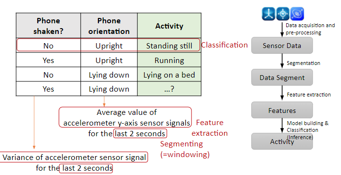
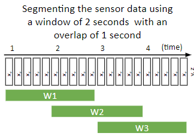
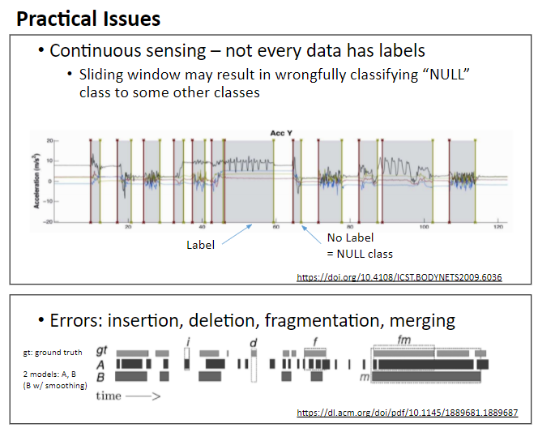
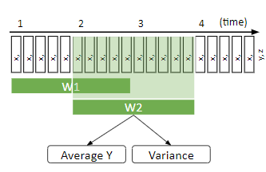
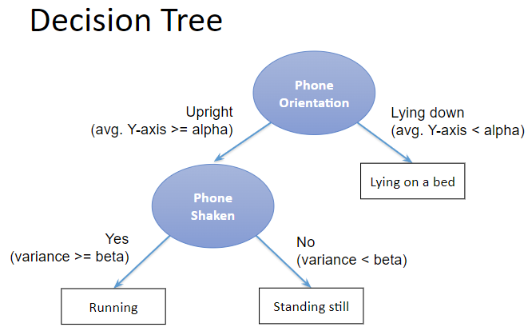
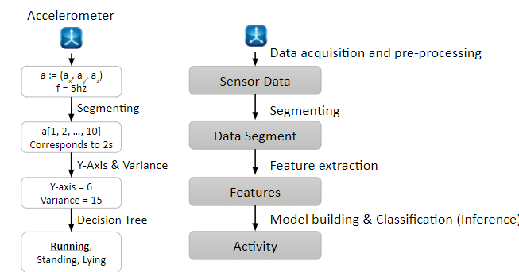

## An Overview of Sensor Data Analysis Process 

## (Mobile vs. Fixed Sensing Cases)

### Sensor Data Gathering & Processing

* Getting sensor data 
  * From which sensors? (e.g., motion sensors, current sensors) 
  * From where? Phone (wearable) vs. factory (stationary) 
  * How? (e.g., wireless or wired, hierarchical?) 
* Processing sensor data
  * Why? For what? (e.g., activity recognition or fault detection) 활동인식, 오류감지
  * How (procedure)
    * Sensor data processing pipeline: collect 🡪 segment 🡪 extract추출 🡪 classify분류 
      (데이터가 너무 많아서 segment를 생성해야 함)
    * Sensor fusion – leveraging multiple sensors for better classification 
      센서 융합- 더 나은 분류를 위해 여러 센서 활용

### 1. Mobile Sensing with Smartphones

* Galaxy S20 Sensors
  * Accelerometer, Magnetometer(나침반), Gyroscope(회전방향), Ambient Light, Proximity(전화시 화면어두워짐), Camera, Voice, Pressure, NFC, Heart Rate, Fingerprint scanner

* Applications 

  * Health and Well Being - Promoting personal fitness(UbiFit Garden, Move, Google Fit)

  * Transportation - Traffic conditions, Driving Behaviors(MIT DriveWell) 

  * Social Networking - Sensing presence(Dartmouth CenceMe) 

  * Environmental Monitoring - Measuring pollution(UCLA PIER)

- Eco-system Players

  * Multiple vendors - Apple AppStore, Google Play, Microsoft Mobile Marketplace

  * Developers - Startups, Academia, Small Research laboratories, Individuals

  * Critical mass of users

- Scale of Mobile Sensing
  * Individual - UbitFit Garden => Group - Garbage Watch =>  Community - Participatory Urbanism 

- Sensing Paradigm
  - Participatory: active sensor data collection by users 사용자에 의한 능동 데이터 수집
    - Example: managing garbage cans by <u>taking photos</u>
    - Advantages: supports complex operations
    - Challenges: Quality of data is dependent on participants
  - Opportunistic: automated sensor data collection 자동화된 데이터 수집
    - Example: collecting GPS location traces from users’ phone
    - Advantages: lowers burden placed on the user
    - Challenges: 
      - Technically hard to build – people underutilized
      - Phone context problem (dynamic environments)

- Mobile Sensing Architecture

  * **Sense**
    * Programmability
      * Managing smartphone sensors with system APIs
      * Challenges: fine-grained정밀한 control of sensors, portability휴대성 (OS & sensor variation) 
    * Continuous sensing 연속 감지
      * Resource demanding (e.g., computation, battery)
      * Energy efficient algorithms; trade-off between accuracy and energy consumption
        정확도와 에너지 소비간의 균형
    * Phone context
      * Dynamic environments affect sensor data quality 동적환경->센서데이터품질에 영향
      * Some solutions: Admission controls for removing noisy data, Collaborative multi-phone inference (i.e., using multiple sensors) 다중센서 사용
    * Time consuming 시간 소모
      * Most labor intensive work in sensor data science 가장 노동 집약적인 작업
      * Sensor data + label collection 센서 데이터 + 라벨 수집

  * **Learn**
    * Integrating sensor data 센서 데이터 통합
      * Data mining and statistical analysis
    * Learning algorithms 
      * Supervised: data are hand-labeled (e.g., cooking, driving) 수동 라벨 지정
      * Semi-supervised: some of the data are labeled 일부만 라벨 지정
      * Unsupervised: none of the data are labeled 라벨 없음
    * Example: human behavior and context modeling 인간행동 모델링
      * Activity classification 활동 분류
      * Mobility pattern analysis (place logging) 이동성 패턴 분석
      * Noise mapping in urban environments 도시환경의 노이즈매핑
  * Learn : Scaling Models 모델 확장하기
    * Scaling model to everyday uses 
      * Dynamic environments; personal differences 동적 환경 - 개인차
      * Large scale deployment (e.g., millions of people) 대규모 배포
    * Models must be adaptive and incorporate people into the process 적응력, 사람통합
    * If possible, exploit wisdom of crowd (or crowdsourcing) to improve data classification and solutions 
    * Challenges:
      * Lack of common machine learning toolkits for smartphones 
      * Lack of large-scale public data sets 
      * Lack of public repository for sharing datasets, code, and tools 

  * **Inform, Share, Persuasion** 알림, 공유, 설득
    * Sharing
      * Data visualization, community awareness, and social networks
        데이터 시각화, 커뮤티니 인식, 소셜 네트워크
    * Personalized services 맞춤형 서비스
      * Profile user preferences, recommendations, persuasion 선호도, 추천, 설득
    * **Persuasive technology 설득 기술** – systems that provide tailored feedback with the goal of changing user’s behavior 사용자 행동 변화를 목표로 맟춤형 피드백을 제공
      * Motivation to change human behavior (e.g., healthcare, environmental awareness)
        인간 행동을 바꾸려는 동기 (건강관리, 환경 인식)
      * Methods: self-reflection, goal setting, social competitions 자기반성, 목표설정 
      * Interdisciplinary research combining behavioral and social psychology with computer science 행동심리학, 사회심리학 + 컴퓨터 공학 결합

* Privacy Issues 개인 정보 보호 문제
  * Respecting the privacy of the user is the most fundamental responsibility of a mobile sensing system 사용자의 프라이버시를 존중하는것은 모바일센싱시스템의 가장 기본적인 책임이다.
  * Reconstruction type attacks 
    * Reverse engineering collected data to obtain invasive information 
  * Second-hand smoke problem
    * How can the privacy of third parties be effectively protected when other people wearing sensors are nearby?
    * How can mismatched privacy policies be managed when two different people are close enough to each other for their sensors to collect information?
  * Understanding of privacy issues of novel mobile and wearable technologies is required 
  * Furthermore, stronger techniques for protecting people’s privacy are needed 강력한기술필요
  * Current solutions 현재 솔루션
    * Cryptography 암호화
    * Privacy-preserving data mining 개인 정보 보호 데이터 마이닝
    * Processing data locally versus cloud services 클라우드 서비스와 비교하여 로컬에서 데이터 처리
    * Group sensing applications is based on user membership and/or trust relationships
      그룹 센싱 애플리케이션은 사용자 멤버십, 신뢰관계를 기반

### 2. Case Study of Mobile Sensing: *Human Activity Recognition using Smartphones*

* Activities

  * High-level activities - giving a lecture, having a breakfast, ...
  * low-level activities - lying on a bed, standing still, running, ...

* #### Activity Recognition Process 활동 인식 프로세스

  * Motion Sensors [accelerometer(xy), compass, gyroscope]

    (Data Acquisition & Pre-processing 수집,전처리)=> Sensor Data 

    (Segmentation)=> Data Segment 

    (Feature Extraction 특징 추출)=> Features 

    (Model 구축, 분류(추론))=> Activity 

  

* **Data Acquisition & Pre-processing** 데이터 수집, 전처리
  * Collecting a stream of sensor data (e.g., using Android’s sensor manager interface)
  * Since most sensors provide data on some regular basis, we also need to know **sampling rate** (will learn more about this during DSP sessions)
  * An accelerometer, for example, may provide a stream of tuples of real numbers representing the acceleration in x, y and z-direction with 5 Hz 
  * Cf) Android’s sensing rate configuration
    * Predefined rates: SENSOR_DELAY_NORMAL, UI, GAME, FASTEST 
      * Or, the desired delay between events in microseconds
    * Actual rate is device-dependent; e.g., Nexus 5 (Normal/UI: 15 Hz; Game: 50 Hz; Fastest: 200 Hz)
    * Note that your smart devices will not guarantee such rates, and actual rate is dependent on its operating conditions (e.g., workload) 

* **Data Segmentation**

  * For feature extraction, we need to “identify” those data segments that are likely to contain information about activities (known as “activity detection” or “spotting) 

    * **Sliding window**: using a window (=frame) of samples, and simply slide that window with fixed overlapping (e.g., 50%) 
    * Energy based: different activities have different activity “intensities” (or energy) (e.g., rest vs. others) – moving avg. can be used for automatic segmentation 

  * In our example, to recognize basic physical activities we collect the data of 2 seconds from the accelerometer. 

  * This corresponds to 10 readings of the acceleration data (if sampling rate is fixed to 5Hz)

    

* **Feature Extraction** 특징 추출

  * How to extract features? 

    * Signal-based features – mean, variance, kurtosis 
    * Body model features – exploiting prior knowledge about human kinematics 
    * Event-based features – if there are any events (e.g., a sequence of eye movements – saccades, fixations, or blinks) 
    * Multilevel features – duration, frequency, co-occurrence, clustered data/labels 

  * In our examples, we extract the following features:

    * Average value of accelerometer’s y-axis signals
    * Variance of accelerometer sensor signals 

    

* **Classification** 분류

  * After extracting important features from the raw data, we use a classifier to determine the current activity

  * Many different classification algorithms exist, and depending on the application domain, there may be one algorithm that shows the best performance 

  * Depending on the algorithm, the result is either a crisp decision (e.g., decision tree), or a probability distribution over activities (e.g., Naïve Bayes) 

  * Learning algorithms: supervised vs. unsupervised (based on whether training dataset is used or not) 

    

#### Summary

​	

