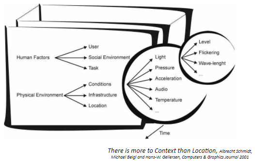

## [3] Context-Aware & Persuasive Computing

## Context-Aware Computing

> “software that examines and reacts to an individual’s changing context” - *Schilit, Adams, & Want (1995)*
> 개인의 변화하는 context에 따라 반응하고 조사하는 소프트웨어
>
> “.. uses context to provide relevant info and/or services to the user” - *Dey (2001)* 
>
> “…aware of its user’s state and surroundings, and help it adapt its behavior” - *Satyanarayanan (2002)*

### 1. What is context?

* “any information that can be used to characterize the situation of an entity” 
  엔티티의 상황을 특성화하는데 사용할 수 있는 모든 정보

* Entity: person, place, or object that is relevant to the interaction between a user and an application (including the user and applications themselves)
  엔티티 : user <-> application 상호작용과 관련된 사람, 장소, 객체

* Who + What + When + Where -> Why? 

* Schmidt, Beigl, Gellersen’s model (2001):

  * A context describes a situation and the environment a device/user is in
  * A context is identified by a unique nameFor each context a set of features is relevant
  * For each relevant feature a range of values is determined (implicitly or explicitly) by the context 관련기능에 대해 값 범위는 context에 의해 결정됨(암시적, 명시적)

  

* ##### Beyond Simple Context: SHM

  * **Structural Health Monitoring (SHM)** aims to identify **damages** in systems

    

* ##### Beyond Simple Context: Digital phenotyping/biomarkers 

  

  * **Digital phenotype** means personal digital footprints of biological, behavioral, and environmental data, captured either consciously or unconsciously by smart devices and wearables (Nature Biotechnology, 2015) 

    

### 2. Acquiring(파악) context 

* Smart environment: 스마트 환경
  * Infra for obtaining context and for providing context to mobile apps
  * E.g., active badge system: a badge sensing system that obtains location info
* Mobile sensors: 모바일 센서
  * Embedded sensors in smart devices 내장된 센서
  * E.g., digital cameras w/ motion sensors, smartphones w/ light and motion sensors (automatic brightness control, screen rotation)

* Sensor fusion 센서 융합
  * Fusion of multiple sensors to infer a user’s context
  * Example: 
    * Based on statistical analysis of sensor data, specify rules for context recognition
    * Sensor fusion: sensors => cues (abstracted representation of sensor data: symbolic) => context (can be represented using a set of cues)
    * Context - In the office // Cues - Artificial light, stationary or walking, room temperature, dry

* Categorizing Context-aware Apps

  * Design dimensions

    * Info vs. command: whether the task at hand is getting information or doing a command

    * Manual vs. automatic: whether the task is effected manually or automatically

      

* Proximate selection (근접 선택)

  * A user interface technique that makes the located objects “emphasized” or “being easier to choose” 찾은 개체를 강조 / 선택하기 쉽게 만드는 사용자 인터페이스 기술

  * Located objects 찾은 개체

    * Computing devices; 
      e.g., display, speakers, thermostats, wifi hotspots 
    * Non-physical objects and services accessed at a particular location; 
      e.g., menus, lists of instructions or regulations
    * Places that users want to find (like yellow pages); 
      e.g., sorting places according to the distance

  * Proximate selection dialog for printers (name of the printer, location, a distance from the user)

    

  * How about using an interactive map? (virtual objects = questions in Naver KiN “Here”)

### 3. Using context info

* Contextual Info and commands
  * People’s actions can be predicted by their situations, e.g., library, kitchen, office, etc.
  * Context parameterizes “context command”; e.g., print – by default: print to the nearest printer
  * PARCTAB’s location-based file system
    * Directories are location names, containing files, programs, and links 
    * Location browser automatically shows the directory that matches with the current location
      * Office: occupants’ finger plans, calendar files
      * Lab: general description of the research group
    * Location browser also runs “contextual commands”
      * Migrate a remote app’s window to a nearby display
      * Display a library catalog (when entering the library, this button pops up) 
  * Cyberguide (1997) : A Mobile Context-Aware Tour Guide, G. D. Abowd et al, Wireless Networks, 1997
  * Geonotes (Espinoza et al., 2001) - Real-world annotation (post-it?) 

* Automatic contextual reconfiguration 자동 상황별 재구성
  * Process of adding new components, removing existing components, or altering the connection between components 새 구성 추가, 기존 구성 제거, 구성요소간 연결 변경
  * Components and connections: client UI, servers, their communication channels to clients
    * Changing connections
    * Changing client/server states (internal + UI) 
  * Light sensitive display
  * Orientation-sensitive user interface
  * Virtual whiteboard example:
    * When entering a room, a mobile host automatically binds itself to the room’s virtual whiteboard
  * SenSay (Siewiorek et al., 2003)
    * A context-aware mobile phone with four states: Uninterruptible, Idle, Active, and Normal (default)
* Context-triggered actions
  * Simple condition-action rules invoked automatically 
  * Challenges:
    * Expressiveness of language for rules
    * Context sensing accuracy used in the condition/action 
  * Active Badge:
    * Rule form: badgeID location event-type action
    * if I go walk by kitchen, remind me to get coffee (e.g., playing a music) – similar to IFTTT 
  * Example: Siren (Jiang et al., 2004)

### 4. Persuasive Computing

* Persuasive Technology 설득 기술

  * "Simply put, a persuasive computer is an interactive technology that changes a person's attitudes or behaviors or both.“ (B.J. Fogg)
  * Persuasion is "an attempt to shape, reinforce, or change behaviors, feelings, or thoughts about an issue, object, or action” 
  * Attitude or behavior change resulting from human-computer interaction (HCI)
  * Planned persuasive effects of technology, not on side effects. 
  * Endogenous, or “built-in,” persuasive intent, not on exogenous intent. 

* Advantages over Human Persuaders

  * Be more persistent than human beings 
  * Offer greater anonymity 
  * Manage huge volumes of data (store/access/process)
  * Use many modalities (data, graphics, audio/video, simulation) to influence 
  * Scale easily 
  * Go where humans cannot go or may not be welcome (ubiquitous computing!) 

* Functional triads of persuasive tech

  

  * Nintendo's Pocket Pikachu
    * Tool - Automatic step counting
    * Medium - not clear
    * Social Actor - Pocket Pikachu (virtual pet)

  * Data-driven In-Situ Intervention
    * Sense -> Analyze -> Inform & Act

### 5. Errors

* When the system does the wrong thing
  * Automatically locking car doors
  * Screen saver during presentation
  * Microphone amplifying a whisper
* False positives vs. false negatives
  * Application requirement dependent: e.g., machine fault detection (false negative must be minimized)
* Whose fault: System vs. User? 
* How to get over such errors? 

### 6. Human in the loop

* Context data must be coupled with the ability to interpret it, but computers are bad at common sense
* Having more rules makes the system more complicated; doesn’t solve the fundamental problem
* Human in the loop
  * Computers can detect, aggregate, and portray information
  * Allow human users to interpret and act on it
  * Human-AI interaction: query, machine feedback, interpretability
