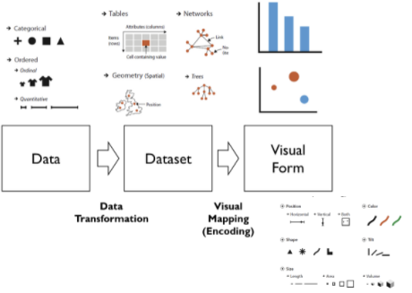

## [4] Data Visualization for Sensor Data Science

## Part 1

### Graphical Integrity 무결성 

* Scale Distortions 왜곡

* Tufte’s Integrity Principles
  * Clear, detailed, and thorough labeling and appropriate scales
  * Size of the graphic effect should be directly proportional to the numerical quantities (“lie factor”)
  * Show data variation, not design variation

### Visualization Design Principles

* Maximize Data-Ink Ratio, with reason
* Avoid Chartjunk
* Increase Data Density
  * Data density = <u>Number data items</u> / Area of data in graphic

### Graphic Design Principles : CRAP

* Contrast
  * If two items are not exactly the same, then make them different. Really different.
* Repetition
  * Repeat some aspects of the design throughout the entire piece
* Alignment
  * Nothing should be placed on the page arbitrarily
  * Every item should have a visual connection with something else
* Proximity
  * Group related items together . . . as physical closeness implies a relationship

## Part 2 

### Data Visualization Steps & Visual Encoding

* Data Visualization Steps

  

* Data Types
  * **N**ominal (categorical) 	
    * Are = or ≠ to other values Apples, Oranges,  Bananas,...
  * **O**rdinal (ordered)  
    * Obey a < relationship Small, medium,  large
  * **Q**uantitative
    * Can do arithmetic on them 10 inches, 23 inches, etc

* Visual Mapping (Encoding)

### Visualization Taxonomy & Statistical Graphs – A Tour through the visualization zoo 

