## [5] Sensor Datasets

### ◆ CrowdSignals.io

> CrowdSignals: a call to crowdfund the community's largest mobile dataset

* During the course we will use a running example provided by CrowdSignals.io 
* People share their mobile sensors data (smart phone and smart watch) and get paid for annotating their data with activities 

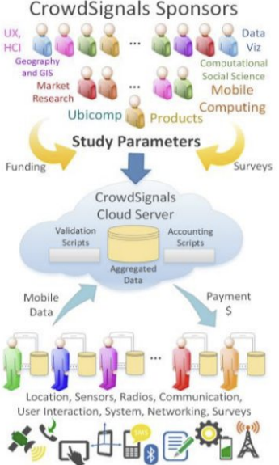

* Dataset

  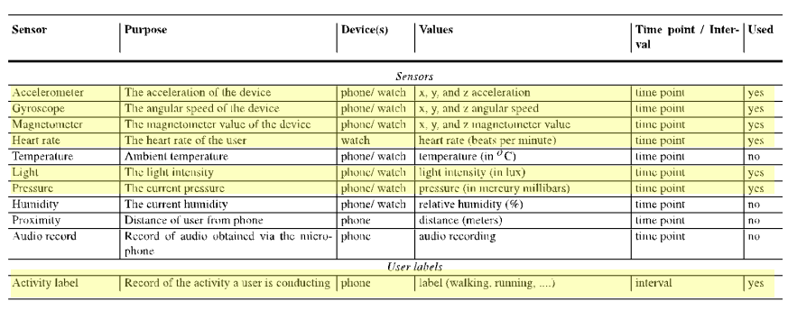

* Raw data

  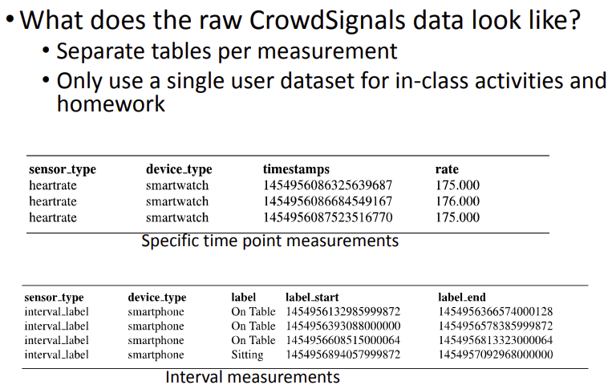

#### Data Collection

* Data Collection is the **Most Challenging Task** in Sensor Data Science

* Methods

  * Local administration (LA) 

    * Researchers painstakingly recruit, on-board, and manage subjects in person, compensating them with smartphones and a mobile data plan 
      연구원이 직접 피험자를 모집, 관리하며 스마트폰과 모바일데이터 요금제로 보상
    * Examples: MIT, Nokia, UB, and SMU campaigns

  * App store-based (AS) 

    * An app is distributed to 1,000s of users via an app store (e.g., CenseMe project) 
      앱스토어를 통해 1000명의 사용자에게 앱 배포

  * Crowdsourced (CS) 

    * Remote subjects are rapidly recruited, managed, and paid with a crowdsourcing service, but they install a data collection app on their own phone
      휴대폰에 데이터 수집 앱을 설치

    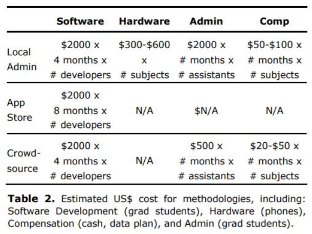

### ◆ K-EmoCon

> K-EmoCon: A Multimodal Sensor Dataset for Continuous Emotion Recognition in Naturalistic Conversations
> 자연스러운 대화의 지속적인 감정 인식을 위한 다중모드센서 dataset

*  Dataset for <u>continuous</u> emotion recognition in <u>naturalistic conversations</u> (N=32) 
* Collected both self-reported labels and perceived labels 
* Multimodal data 
  * Audio: speech 
  * Visual: facial expressions and gestures 
  * Physiological: acceleration, heart rate, inter-beat interval (IBI), electrodermal activity (EDA), skin temperature, electroencephalogram (EEG), and electrocardiogram (ECG) 
* Used off-the-shelf grade sensors and equipments to collect data

* Data collection

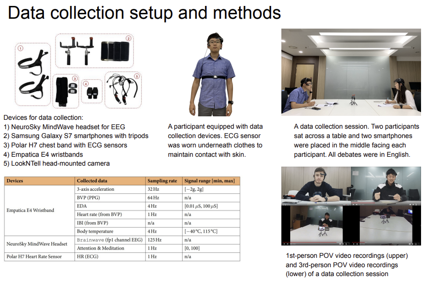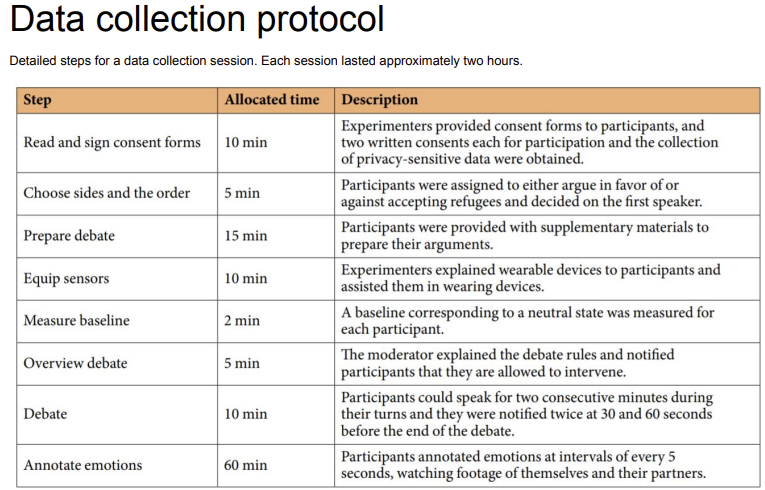

* Data collection results - 3 Labels per 5s Segment

  * Annotation via “retrospective affect judgment protocol” 
    * Each participant watched one audiovisual recording of him/herself and another recording of his/her partner (both recordings from 2nd-person POV, including facial expressions, upper body movements, and speeches), to annotate emotions at intervals of every 5 seconds from the beginning to the end of a debate 

  1. The subject – is the source who experiences emotions firsthand and produces self annotations, particularly the “felt sense” of the emotions 
  2. The partner – is the person who interacts with the subject, experiencing the subject’s emotions secondhand; thus, he or she has a contextual knowledge of the interaction that induced the subject’s emotions and produces partner annotations based on that 
  3. The external observers – are people who observe the subject’s emotions without the exact contextual knowledge of the interaction that induced the emotions, producing external observer annotations

* Dataset Summary

  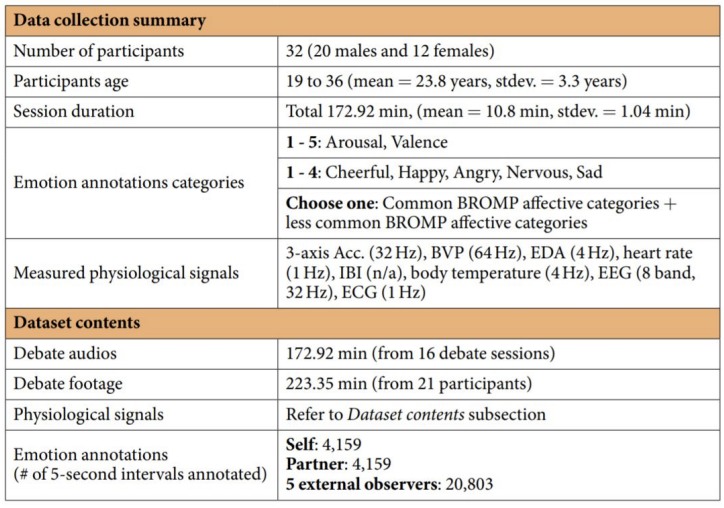

* Preliminary analysis results

  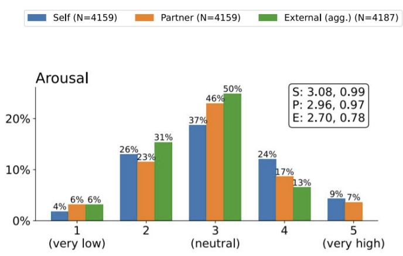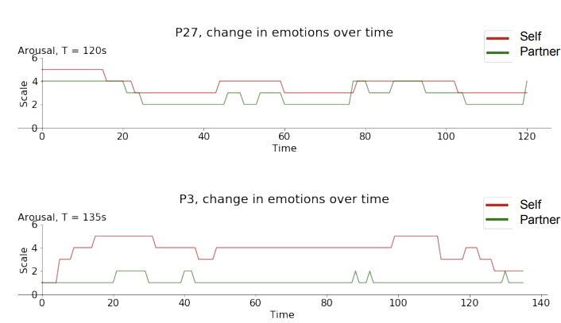

  > Mismatch in labels is highly variable across individuals. 
  > 라벨의 mismatch는 개인마다 매우 다양함

### ◆ K-EmoPhone

> K-EmoPhone: A Multimodal Mobile and Wearable Sensor Dataset for Emotion and Stress Recognition in the Wild 
> 야생에서 감정, 스트레스 인식을 위한 다중모드 모바일 및 웨어러블 센서 dataset

- Data collection
  - #users: n =79 
  - 1-week (84 hrs) 
  - In-the-wild scenarios (everyday life scenarios) 
- Devices 
  - Wearable #1 Microsoft Band 2 
  - Wearable #2 Polar HR 
  - Smartphone 
- Self-report data 
  - Experience Sampling Method (ESM): 6,173 ESM responses in total
  - User characteristics - General health questionnaires (GHQ-12) , Stress (PSS-10) , Depression (PHQ-9) , Personality (BFI-15) , Self-esteem (RSE-10) 

* KAIST K-EmoPhone Dataset
  * "Emotion & Stress Tracking"
  * Smartphone + wearable sensors(Microsoft Band 2, Polar H10)
    * Microsoft Band 2
      * Calories, Accelerometer, GSR, AmbientLight, HearRate, RRInterval, Distance, Pedometer, UV, SkinTemperature
    * Polar H10 - Physiological Signals
      * Heart Rate (bpm)

* Ground Truth Labeling "Emotion & Stress Tracking"

  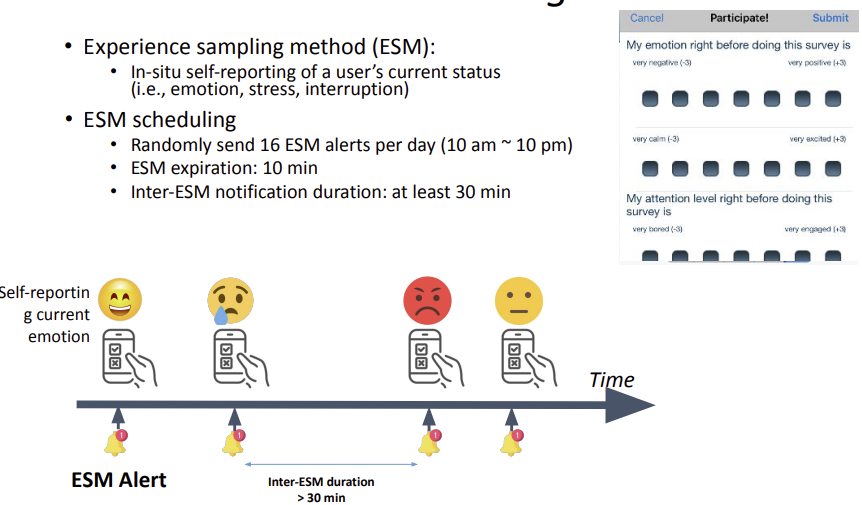

### Raw Data Transformation

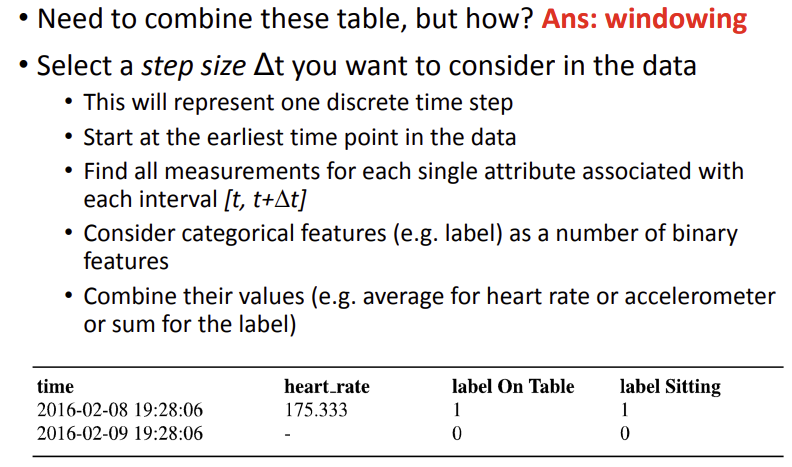

### Data Exploration

- Let us consider a dataset from CrowdSignals which covers around 2 hours of data 
- Imagine we take a step size of Δt = 1 minute and Δt = 250 milliseconds 
- What difference would you expect in the spread of the data? 
- What are the pros and cons of a higher value for Δt (less fine grained)?

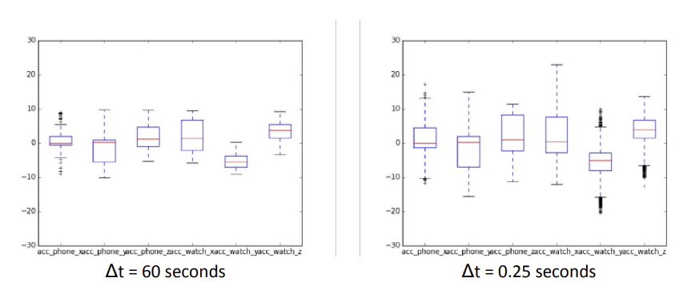

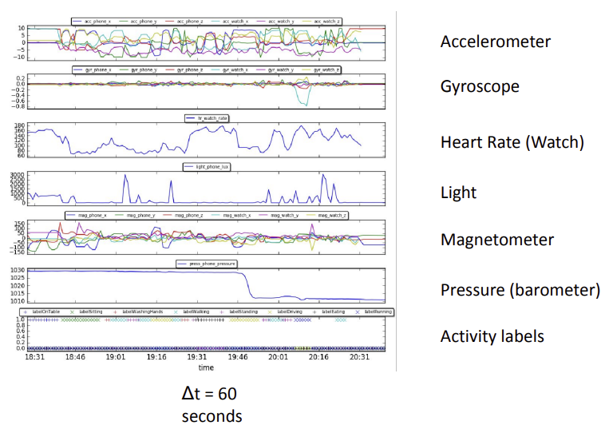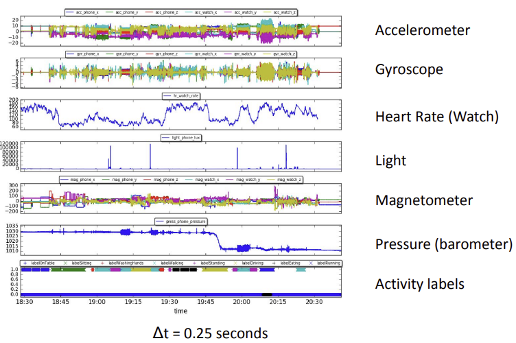

## Colab for Sensor Data Processing

> Accessing data through Google Drive
>
> Using Pandas for data pre-processing

