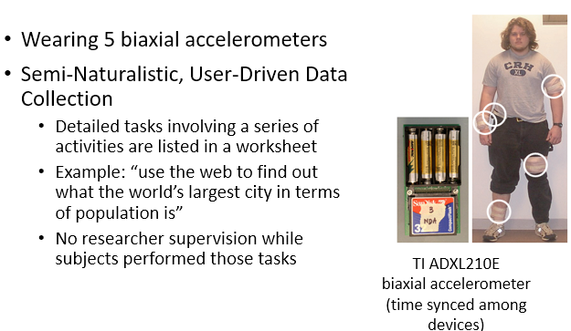

## [6] **Sensor Data Collection** 

* Mobile & Wearable Sensing
  * Digital phenotype - Personal digital footprints of biological, behavioral, and environmental data, captured either consciously or unconsciously by smart devices and wearables (Nature Biotechnology, 2015) 

### Ground truth lebeling

> * Elicitation 도출 : recording sensors data for a given stimulus(자극) (=ground truth) 
> * Natural setting : asking a user to self-label (in-situ: ESM, or review/recall) 
> * Observation 관찰 : 3rd person labeling (in-situ or video reviewing)

* Activity
  * Elicitation : asking users to follow a predetermined scenarios 
  * Natural : in-situ labeling – asking people to label a current activity whenever there’s a change of activity 
  * Observation : real-time following (observer) or video recording with post-hoc labeling 
* Emotion
  * Elicitation : watch “emotional” videos or doing some tasks that can “elicit” specific emotional states 
  * Natural : experience sampling – randomly asking a user to label a current emotion state 
  * Observation : 3rd person judges a user’s emotion (e.g., watch facial videos and label emotion) 

* Activity Recognition

  

* Emotion - DEAP

  * Elicitation – Stimuli w/ specific emotion (EEG)
    * Watch one-min video and then rate current emotion 

* Experience Sampling Method (ESM)
  * Also known as EMA (Ecological momentary assessment) 
  * Parameters to consider 
    * Notification schedule 
    * Random: e.g., max 10 times a day 
    * Interval: e.g., every hour 
    * Event: e.g., incoming calls, app use 
    * Notification expiry (lifetime) (e.g., must be answered in 3 minutes)
    * Inter-notification time (e.g., min time in between notifications) 
    * Inquiry limits (max # of ESM notifications per day) 
    * Study duration (how long?) 

### Smartphone sensors

> •Android programming basics
>
> •Android sensors
>
> •Motion sensors (accel, compass, gyro), light, pressure, temperature, activity, GPS
>
> •Digital behavior sensing (app usage, key typing) 

* Android - Galaxy S20 Sensors

  * Accelerometer, Magnetometer (Compass), Gyroscope Ambient  Light, Proximity, Camera, Voice, Pressure  (Barometer), NFC, Heart Rate, Fingerprint scanner

* SensorManager
  * SensorManager & LocationManager 
    * Obtain pointer to android service using  
      ` Context.getSystemService(name)**`
    * For name, use constant defined by Context class 
      * SENSOR_SERVICE for SensorManager 
      * LOCATION_SERVICE for LocationManager 
  * Check for available sensors using 
    `List<Sensor> getSensorList(int type) `
    * Type constants provided in Sensor class documentation 
  * Use getDefaultSensor(int type) to get a pointer to the default sensor for a particular type 
    `Sensor accel = sensorManager.getDefaultSensor( Sensor.TYPE_ACCELEROMETER);`
  * Register for updates of sensor values using  `registerListener(SensorEventListener, Sensor, rate) `
    * Rate is an int, using one of the following 4 constants 
      * SENSOR_DELAY_NORMAL (delay: 200ms)
      * SENSOR_DELAY_UI (delay: 60ms)
      * SENSOR_DELAY_GAME (delay: 20ms)
      * SENSOR_DELAY_FASTEST (delay: 0ms)
    * Or, the desired delay between events in microseconds (as of Android 2.3)
    * Use the lowest rate necessary to reduce power usage
  * Registration will power up sensor:
    `mSensorService.enableSensor(l, name, handle, delay);`
  * Unregister for sensor events using 
    `unregisterListener(SensorEventListener, Sensor) `
    or `unregisterListener(SensorEventListener)`
  * Undregistering will power down sensors:
    `mSensorService.enableSensor(l, name, handle, SENSOR_DISABLE)`
  * Perform **register in OnResume()** and unregister in OnPause() to prevent using resources while your activity is not visible 

* SensorEventListener
  * Must implement two methods 
    * `onAccuracyChanged(Sensor sensor**,** int accuracy) `
    * `onSensorChanged(SensorEvent event) `
  * SensorEvent 
    * int accuracy 
    * Sensor sensor 
    * long timestamp 
      * Time in nanoseconds at which event happened 
    * float[] values 
      * Length and content of values depends on sensor type 

* Digital Behaviors
  * App Usage: app categories, app switching
  * Notification handling behaviors 
  * Keyboard typing: flight time/distance 

### Wearable sensors

* Sensors

  * Empatica E4 (EDA/PPG/Temp), Samsung Watch 3 (PPG/SpO2/ECG)
  * Polar H10 (ECG), Polar OH1 (PPG) 
  * OpenBCI, NeuroSky, Emotiv (EEG) 
  * Glass: jins-meme (EOG) 

* Sensing

  * EDA (Electro-Dermal Activity) 
    * Féré (1888) discovered that the skin momentarily becomes a better conductor of electricity when external stimuli are presented 
  * ECG (Electro-Cardio-Gram) - 심전도
  * PPG (Photo-Plethysmo-Gram) / SpO2 
    * PPG sensor output - BVP (Blood Volume Pulse)
    * Multi-wavelength PPG (different depth)
  * EEG (Electro-Encephalo-Graphy)
  * EOG (Electro-Oculo-Gram)