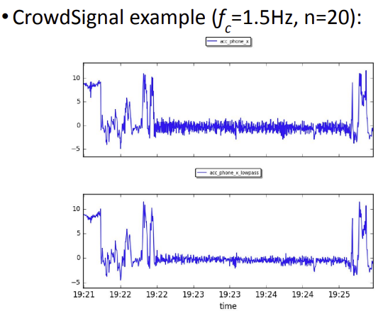
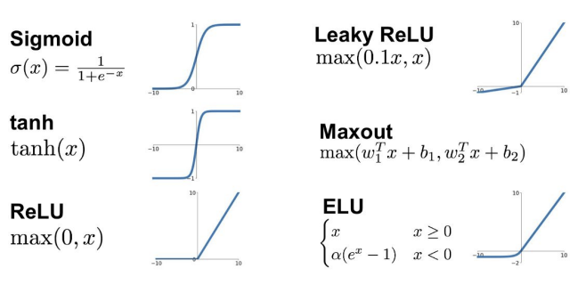

## [7] Handling Noise and Missing Values in Sensory Data

> • Previously: we collected the data
>
> • Today: Removing noise from the data - Removal of outliers , Imputation of missing values
> 				, Transform the data to select the most useful information

### Removal of outliers

* An outlier is an observation point that is distant from other observations

  

* Causes?
  * Measurement errors
    * Faulty measurement from sensors 
    * For example, Arnold with a heart rate of 400 bpm
    * Must check whether a scale is good enough: valid/reliable? (or is there any systematic bias?)
  * Variability of the target values
    * Due to subject variations or random errors 
    * For example, Arnold trying to push his limits with a heart rate of 190 bpm (say during a hard running instance) 
* Difference between measurement and variability outlier? • Former generated by another mechanism
* How to remove? • Domain knowledge (heart rate cannot be over 220) • Without domain knowledge (our focus) 
* Have to be cautious as you do now want to remove valuable information 
* Categorizing outlier detection methods: • Are there any labeled data? (supervised vs. unsupervised) • Are there any assumptions about normal data vs. outliers? (our focus) • 
* Two types of outlier detection: • Distribution based (statistical): we assume a certain distribution of the data • Distance based (or proximity-based): we only look at the distance between data points

#### Distribution-based outlier detection.

> Assume a normal distribution, single attribute(Xi)

* Chauvenet's criterion

  * Take the mean and standard deviation for an attribute j in our dataset of size N:
  * Take those values as parameters for our normal distribution
  * For each instance i for attribute j compute the probability of the observation:
    * 
  *  

* Winsorizing

  

#### Distance-based outlier detection

* Let us move away from distributions and just consider the distance between points 

* Consider the actual distance metrics later (Chapter 5), but e.g. think of Euclidean distance

* Use d(xa^j , xb^j ) to represent the distance between two values of an attribute j.

* Simple distance-based approach

  * Points are close if they are within distance dmin

  * Points are away if they are placed beyond distance dmin

  * A point is an outlier

    * if a fraction fmin of N points are away (outside of dmin)
      * this means that at least (1-fmin)*N points are close
      * if there are not enough close points, it's likely the point is an outlier

    

  * 

*  

* Local outlier factor

  * Distance based outliers: “Outliers are further away from the normal data” 

    * Use “distance to k nearest neighbors” 

  * Local outlier factor take this density into account

  * First define the distance kdist for a point x i j as the largest distance to one of its k closest neighbors:

  * The set of neighbors of x i j within kdist is called the k-distance neighborhood kdist_nh

    

### Missing values

* Replace missing values by a substituted value (imputation)
* What should these values be?
  * mean (numeric)
  * mode (categorical and numeric)
  * median (numeric)
* 
* 

### Kalman filter

* Outlier detection + imputation
  * Approaches that combine outlier detection and value imputation exist as well 
  * The Kalman filter is a well-known one: 
    * it estimates expected values based on historical data
    * if the observed value deviates too much (i.e., an outlier) we can impute with the expected value

* Assumption 
  * Some latent state s t which can have multiple components
  * Our quantified self data x t is the measurement result about this state 
* For example: • s t is Arnold’s presence at a position and velocity 
  * x t is the GPS data and step counter (observation or measurement)
* Key idea of a Kalman filter
  * We know the underlying process model and measurement model; why don’t we make use of this “prior knowledge” to better calibrate our data?

### Transformation

* Transforming the data
  * Even though we have removed the outliers and imputed missing values we could still suffer from noise in our dataset that could distract the learning process
  * Approaches exist that filter our this more subtle noise
    * Lowpass filter
    * Principal Component Analysis

#### Lowpass filter

* Main idea: some data has periodicity (e.g. walking, running)
* You can decompose a series of values into different periodic signals: 
  * come with their own frequency 
  * we will see about this in Chapter 4
* Some frequencies might be more interesting than others
* For example: we do not care about running (higher frequency), but we do care about walking
* We can filter out the higher frequency data 
* The lowpass filter does exactly this: 
*  

#### Principal Component Analysis

> We can also apply principal component analysis: 
>   find new features that explain most of the variability in our data 
>   select the number of components based on the explained variance 
>   since most are familiar, I will not provide all details, see the book

* Dimension Reduction
  * Reduce n dimensional data into k dimensional data
  * Why?
    * Feature extraction : find a better data representation for the machine learning algorithm intended to use
      * Example : finding linear combinations of the original ones, as in PCA or LDA, as well as nonlinear combinations, like Kernel PCA, t-SNE and autoencoders
    * Feature fusion : combine variables to remove redundant and irrelevant information
  * Principal Component Analysis (PCA) : n => k
    * 
    * Find some orthonormal matrix P where Y=PX such that `CY = 1/(n-1)*YY^T` is **diagonalized** where the rows of P are the principal components of X
      * **Diagonal terms (signals)**: large values correspond to interesting dynamics (correlation w/ principal components – think of projection!)
      * Off-diagonal terms (redundancy): large values correspond to high redundancy 
    * If we choose P to be eigenvectors of XX^T , we can diagonalize C_Y where XX^T is a covariance matrix that captures the correlations between all possible pairs of measurements 
  * Good for data compression (if data size is too big) or visualization (if it is 2D or 3D)
  * 'k' is chosen based on % of variance retained
  * A bad use of PCA : use it to prevent over-fitting
    * If we retain most of the variance, this should work; but we may throw away some crucial data (after PCA, it’s hard to know which feature is missing) 
    * 조심히 생각하고 사용해야함 : 중요한 데이터를 잃을 수 있음

#### t-SNE : beyond PCA

> PCA can’t guarantee “distance” similarity in low dimension space
>
> t-SNE (t-Distributed Stochastic Neighbor Embedding) helps
>
> 

#### Autoencoder

* An unsupervised learning algorithm based on a neural network that applies backpropagation for training, by setting the target values to be equal to the inputs

* Activation function
  * 

* Loss function
  * 

* Taxonomy
  * 
