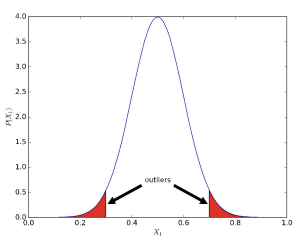

## [7] Handling Noise and Missing Values in Sensory Data

> • Previously: we collected the data
>
> • Today: Removing noise from the data - Removal of outliers , Imputation of missing values
> 				, Transform the data to select the most useful information

### Removal of outliers

* An outlier is an observation point that is distant from other observations

  

* Causes?
  * Measurement errors
    * Faulty measurement from sensors 
    * For example, Arnold with a heart rate of 400 bpm
    * Must check whether a scale is good enough: valid/reliable? (or is there any systematic bias?)
  * Variability of the target values
    * Due to subject variations or random errors 
    * For example, Arnold trying to push his limits with a heart rate of 190 bpm (say during a hard running instance) 
* Difference between measurement and variability outlier? • Former generated by another mechanism
* How to remove? • Domain knowledge (heart rate cannot be over 220) • Without domain knowledge (our focus) 
* Have to be cautious as you do now want to remove valuable information 
* Categorizing outlier detection methods: • Are there any labeled data? (supervised vs. unsupervised) • Are there any assumptions about normal data vs. outliers? (our focus) • 
* Two types of outlier detection: • Distribution based (statistical): we assume a certain distribution of the data • Distance based (or proximity-based): we only look at the distance between data points

#### Distribution-based outlier detection.

> Assume a normal distribution, single attribute(Xi)

* Chauvenet's criterion

  * Take the mean and standard deviation for an attribute j in our dataset of size N:
  * Take those values as parameters for our normal distribution
  * For each instance i for attribute j compute the probability of the observation:
    * 
  *  

* Winsorizing

  

#### Distance-based outlier detection

* Let us move away from distributions and just consider the distance between points 

* Consider the actual distance metrics later (Chapter 5), but e.g. think of Euclidean distance

* Use d(xa^j , xb^j ) to represent the distance between two values of an attribute j.

* Simple distance-based approach

  * Points are close if they are within distance dmin

  * Points are away if they are placed beyond distance dmin

  * A point is an outlier

    * if a fraction fmin of N points are away (outside of dmin)
      * this means that at least (1-fmin)*N points are close
      * if there are not enough close points, it's likely the point is an outlier

    

  * 

*  

* Local outlier factor

  * Distance based outliers: “Outliers are further away from the normal data” 

    * Use “distance to k nearest neighbors” 

  * Local outlier factor take this density into account

  * First define the distance kdist for a point x i j as the largest distance to one of its k closest neighbors:

  * The set of neighbors of x i j within kdist is called the k-distance neighborhood kdist_nh

    

### Missing values

* Replace missing values by a substituted value (imputation)
* What should these values be?
  * mean (numeric)
  * mode (categorical and numeric)
  * median (numeric)
* 
* 

### Kalman filter

* Outlier detection + imputation
  * Approaches that combine outlier detection and value imputation exist as well 
  * The Kalman filter is a well-known one: 
    * it estimates expected values based on historical data
    * if the observed value deviates too much (i.e., an outlier) we can impute with the expected value

* Assumption 
  * Some latent state s t which can have multiple components
  * Our quantified self data x t is the measurement result about this state 
* For example: • s t is Arnold’s presence at a position and velocity 
  * x t is the GPS data and step counter (observation or measurement)
* Key idea of a Kalman filter
  * We know the underlying process model and measurement model; why don’t we make use of this “prior knowledge” to better calibrate our data?

### Transformation

