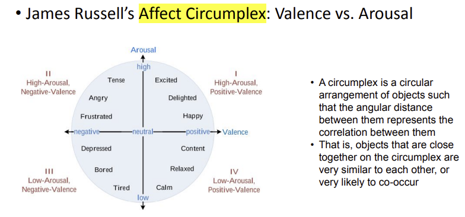

## Sensor Data Applications: Mental Health (Emotion)

* Emotion : Caused by specific event
  * Very brief in duration (seconds or minutes) 대부분 짧다
* Emotion duration
  * Emotions start with occurrence of an external or internal event

* Psychometric Models

  * 

* Measuring Emotion

  * Stimulus (reaction) approaches

    * Ground truth labeling strategies
      *  Stimulus’ label is considered as ground truth 
      * OR, a user’s self-report about their emotional state can be considered as ground truth 

  * Experience sampling approaches (ESM == EMA)

    * Self-reporting a user's feeling via experience sampling

    * Self-reporting measures assessing affect, mood, and emotion 

      

    * Self-reporting measures assessing "stress"

      * Multi-item questionnaries
        * Perceived Stress Scale (PSS) : PSS-14, PSS-10, PSS-4
        * Positive and Negative Affect Schedule (PANAS)
        * Self assessment Manikin, State-Trait Anxiety Inventory and Stress
      * Single item questionnaire for micro-EMA (e.g., using smart watches) 
        * Correlation w/ (1) physiological stress (elicited), or (2) self-reported stress (PSS-4)
        * Correlation with physiological stress signals

* Sensing: Physiological SIgnals

* Agenda
  * cStress : towards a gold standard for continuous stress assessment in the mobile environment
  * MoodScope :  Building a Mood Sensor from Smartphone Usage Patterns
  * Daily Stress Recognition from Mobile Phone Data, Weather Conditions and Individual Traits
  * DeepMood : Forecasting Depressed Mood Based on Self-Reported Histories via Recurrent Neural Networks

### cStress

* Stress Measurement : Lab vs Field
  * **Lab** : Stressors (stimulus approach)
    * Socio-evaluative stressor (speech) - for a given topic, asked to prepare (for 4 minutes) and deliver (for 8 minutes) a speech in front of a research staff 
    * Cognitive stressor - given a three digit number and asked to add three digits of that number, and then add the sum to the three digit number 
    * Physical stressor - asked to leave his/her hand submerged in ice cold water, for 90 seconds (with a break of follow-up 30 min rest period)
  * **Field** : Everyday live situations (waking hours) • Participants will “naturally” experience “stress” while they perform everyday live activities (e.g., work)
  * Measuring stress via "5 item" **self-reports**
  * In-lab study : asked to self-report before, after each stressor
  * Field study : asked to self-report 15 times a day

