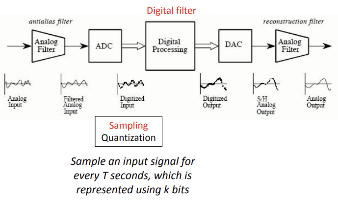
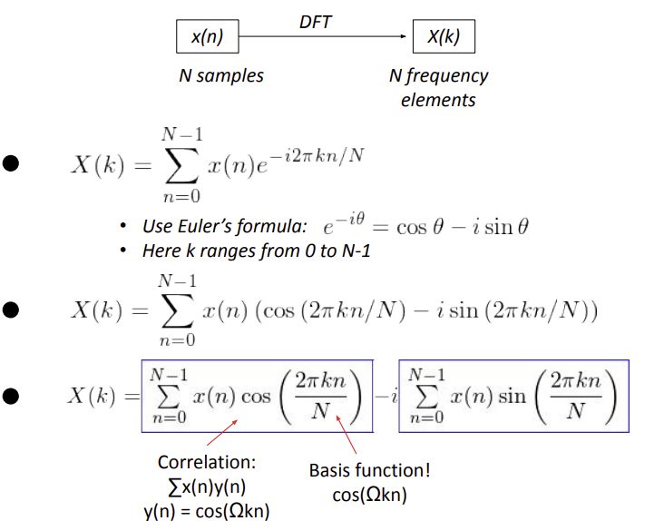

# Digital Signal Processing Fundamentals

* ADC & DAC
* Signal Basics
* ADC
* Discrete Fourier Transform (DFT)
* Energy vs Power

### ADC & DAC

* Block diagram of a DSP system

  

### Signal Basics

* `A(t) = A_m(sin(wt))=A_m(sin(2pi*ft))`

### ADC 

> (Analog to Digital Converter)

* Sampling - What's proper sampling rate?
  * Roughly 2 times of original signal 2배이상 해야함
  * `fs < 2B` => overwriting 됨

* What happens if sampling rate is too low ? Aliasing
  * When you have high resolution digital signals, you may want to perform “under-sampling” (say to improve computation efficiency) 
  * If you’re doing under-sampling, you need to remove “higher frequency” components than “under-sampling” frequency 

### Transforms

* Fourier Transform : continuous and aperiodic
* Fourier Series : continuous and periodic
* Discrete Time Fourier Transform(DTFT) : discrete and aperiodic
* Discrete Time Fourier Series : discrete and periodic

> discrete : one point at a time

* DFT : Discrete Fourier Transform

  

  * Properties
    * Periodicity: x[n] = x[N+n] ⬄ X[k] = X[N+k]
    * Symmetry if x[n] is real: X* [k] = X[-k]
    * Convolution: x[n] 🡪 y[n] ⬄ X[k]Y[k]

