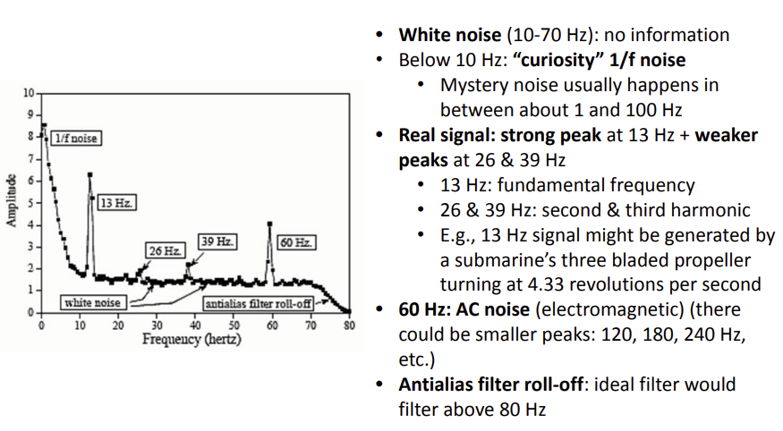

# Digital Signal Processing Fundamentals II - Digital Filter Design
### Spectral analysis of signals 

#### Spectral leakage 스펙트럼 누출

* When having a window of sensor data, spectral leakage could happen!

### Digital filter basics

* Digital filter : numerical procedure or algorithm that transforms a given sequence of numbers into a second sequence that has some more desirable properties
* Input Signal ==> Output 
  * generating by sensing device(microphone) ==> having less noise or interferences
* First method in time domain : Linear difference equations (LTI system)
* Second method in time domain : unit-sample response

### FIR(Lowpass) & IIR filters

* FIR : Finite Number of Samples
* IIR : Infinite Number of Samples

### Correlation (auto vs. cross)

* Correlation is the inner product of two vectors: X and Y: (X^T)Y = |X||Y| cos θ 
* cos θ is also called as the correlation coefficient of x[n] and y[n], and represents an energy-normalized version of correlation 
* If the two signals are initially not of the same duration, then zero-padding should be applied to make their lengths the same
