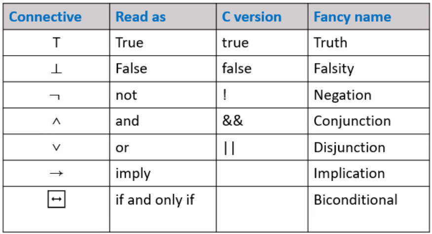
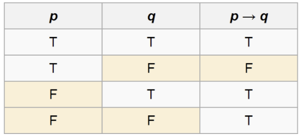
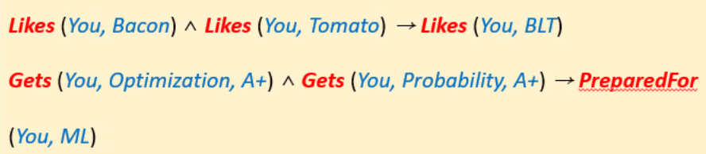
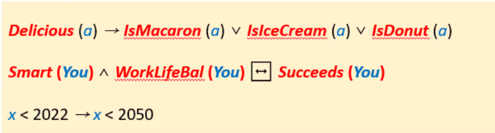
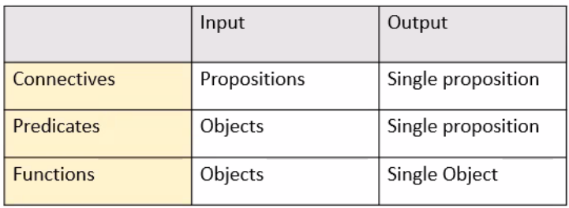

## Logic

* Propositional logic
  * 〓 Boolean algebra
  * Reasoning about Boolean values
* First-Order Logic
  * Reasoning about properties of multiple objects
* Higher Order Logic
  * Second/Third... Order Logic

### 1. Propositional Logic 명제 논리

* Proposition is a statement that is either True or False
* Propositional Logic
  * A mathematical system for reasoning about propositions and how they relate each other
* Every statement in propositional logic consists of propositional variables and (propositional, logic) connectives that combine propositional variables

* #### Boolean Algebra

  * Arithmetic deals with numbers and Algebra deals with variables
  * We can focus on analysis and manipulation of the structure
  * Mathematicians and logicians did the same thing that algebra does for arithmetic
    * Arithmetic(Numbers w/operators) => Algebra (Variables)
    * 

* #### Propositional Connectives 명제 접속사

  * there are 7 (or 5) connectives
  * 
  * Logical "NOT" : ￢
    * Change T to F and vice versa
  * Logical "AND" : ∧
    * p ∧ q = T if both p and q are T / 둘다 T
  * Logical "OR" : ∨
    * p ∨ q = T if at least one of p or q are T

* Inclusive / Exclusive OR

  * The ∨ connective is an "inclusive OR"

    * True if at least one of two operands is true / 적어도 한개 T

  * Exclusive OR : ⊕ 

    > 배타적 논리합. XOR

    * True if and only if exactly one of two operands is True / 한개만 T
    * p ⊕ q = (not(p) and q) or (p and not(q)) , not(p iff q)

* #### Implication

  * p implies q : p -> q

    * If p is True, then q is True

  * Construct the truth table of p->q

    ​	

    > vacously True, False

  * Example : If you work hard (p), then you will get an A+ (q)

* #### Biconditional

  * "p if and only if q" : p ↔ q
  * p ↔ q : (p → q) ∧ (q → p)

* #### Precedence

  * How to parse this statement? ￢p → q ∨ r → p ∨ q ∧ r
    (￢p) → (q ∨ r) → ((p ∨ q) ∧ r)
  * Operator precedence 
    * ￢
    * ∧
    * ∨
    * →
    * ↔
  * All operators are right-associative
  * Use parentheses to disambiguate

* #### De Morgan's Laws

  * ￢(p ∧ q) is equivalent to ￢p ∨ ￢q

* #### Important Equivalences

  * p → q is equivalent to ￢(p ∧ q) = not(p) or nor(not(q)) = not(p) or q
  * ￢(p ∧ q) is equivalent to ?? not(p imply q) = not(not(p) or q) = p and not(q)
  * p → q is equivalent to p ∨￢q ?
  * 

* **Cautions**
  * English sentences and logical connectives sometimes may have different meanings
  * p if q is equivalent to q → p
  * ex. (Women passengers) **AND** (Passengers less than 15 years old) will take lifeboats
  * p : It rained
    q : there is some sunshine
    r : I will see rainbow
    * If it rained, **but** there is no sunshine, then I will not see rainbow
    * (p and not(q)) implies not(r)

### 2. First-Order Logic(FOL)

* Definition : A logic system for reasoning about properties of objects

* Tools that augment the logical connectives from propositional logic

  * Predicates : Describe properties of objects
  * Function: Map objects to another object
  * Quantifier: Allow to reason about multiple objects

* #### (Constant) Symbol, Predicate

  

  * **Constant Symbols** : Refer to objects, not propositions

  * **Predicates**: Take objects as arguments and evaluate to T or F

    => Evaluation results of predicates can be considered as propositions

    => Connect them with propositional connectives

* #### Reasoning about Objects

  * Predicate is to reasoning about objects
  * Example - Delicious (Macaron)
                     - BelongsTo (Seoul, Korea)

  * Applying a predicate to arguments produces a proposition,m which is either True or False
  * In FOL, a list of predicates with specifications will be provided
  * Specifications
    * Definitions, functionalities
    * Types and numbers of arguments they take

* #### First-Order Sentences

  * Sentences is FOL can be constructed from predicates applied to objects

  * 

    > lessThan(x, 2022)

  * < is a predicate
    Binary predicates may written in an ***infix*** notation

  * Numbers and strings are constant symbols like "You" and "a"

* #### Equality

  * FOL is equipped with a special predicate "="
    * check whether two objects are the same or not
  * Equality is a connective like → and ∨
  * Example
    * MichaelJordan = BasketballPlayer
    * Sun = Moon
  * Note : Equality can be applied to objects only
    * ↔ for equality of two propositions(명제)

* #### Functions

  * Functions take objects as input and produces an objects as output
  * Examples
    * YougestOf(SNU) ≠ YougestOf(Kentech)
    * SteepestAscentOf( FavoriteTrailOf(You) )
    * MinimumOf(x,y,z)
    * x + y = plus(x, y)
  * As with predicates, functions can take in any number of arguments, but always return a single value (Object)
  * Functions evaluate to **objects**, not propositions(명제)

* #### Objects & Predicates
  
  * Caution: always keep objects (actual things) and propositions (T or F) seperate
  * Cannot apply connectives to objects
    * Moon ↔ Sun
  * Cannot apply functions to propositions
    * YoungestOf( IsMacaron(a) = IsIceCream(a) ) 
  
* ### Type Checking Table

  

* #### Existential Quantifier: ∃

  * A statement of the form 

    ​	∃x. some-formula

    is True if there exist a choice of x where some-formula if True when that x is plugged into it

  * Examples

    * ∃x.(Even (x) ∧ Prime (x))
    * ∃x.(SmarterThan(x, Einstein) ∧ LessFamousThan(x, Einstein))
    * (∃x.Smiling(x)) → (∃ y.WearingHat(y))
      한명이라도 웃고있음=T → 아무도 모자 없음=F ⇒ False

