## Finite Automata

* Computatiability Theory 
  * We now know that computers can do many things. Before Turing, computers are for simple computations. Researchers wondered the capability and limit of computers.
* Two Challenges
  * Computers are dramatically better now than they've ever been, and that trend continues
  * Key Question: How can we prove what computers can and can't do ...

### Automata

* An automaton is a mathematical model of a computing device 
  automaton(자동장치)는 컴퓨팅 장치의 수학적 모델
  * Automata: Plural of Automaton 자동장치의 복수형
* It's and abstraction of a real computer, the way that graphs are abstractions of social networks, electrical grids, etc. 
  실제 컴퓨터의 추상화, 그래프가 소셜네트워크, 전기그리드 등의 추상화 방식
* The automata are 
  * Powerful enough to capture huge classes of computing devices 강력함
  * Simple enough that we can reason about them in a small space 간단함
  * Fascinating and useful in their own rights 매력적이고 유용함

### Computing with Finite Memory

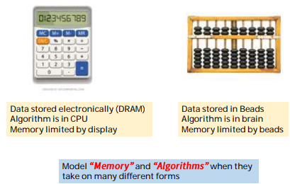

* Common Characteristics
  * These devices (machines) receive input from an external source 외부로부터 입력받음
    * Input is provided sequentially, one discrete unit at a time
  * Each input cases the device to change configuration
    * Computation is done through configuration changes
  * Once all input is provided, we can read off an answer based on the configuration of the device 모든 입력이 제공되면, 장치 구성에 따라 답변을 읽을 수 있다.

* Modeling Computation 계산

  * We will model a finite memory computer as a collection of states linked by transitions

  * Each state corresponds to one possible **configuration(구성)** of the device's memory

  * Each transition indicates how memory changes in response to inputs

  * Some state is designated as the start state

    * The computation begins in the start state

    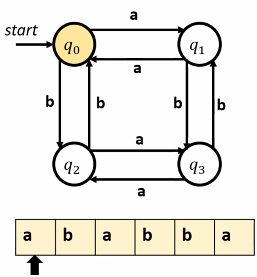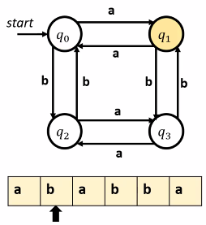

  * This device processes strings made of characters

    * Each character represents some external input to the device
    * The String represents the full sequence of inputs to the device

  * To run this device, we begin in our start state and scan the input from left to right

  * Each time the machine sees a character, it changes state by following the transition labeled with that character

    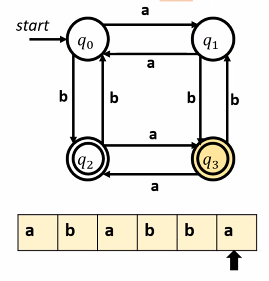

  * Once we've finished entering all the 

    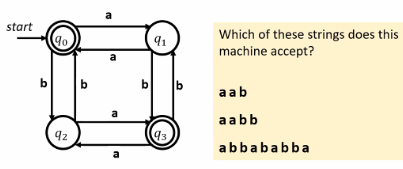

  * If the machine ends in an accepting state after seeing all the input, accepts the input(says YES)

  * If the machine does not end in an accepting state after seeing all the input, it rejects the input (says NO)

    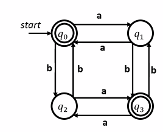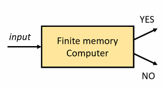

  * This type of computational machine is called a **finite automaton** (plural: finite automata)

  * Finite automata model computers where (1) **memory is finite** and (2) the computation produces as **YES/NO** answer

  * In other words, finite automata model predictates, and do so with a fixed, finite amount of memory

### Strings

* An alphabet is a finite, nonempty set of symbols called characters
* Typically, we use the symbol ∑ to refer to an alphabet
* A string over an alphabet ∑ is a **finite** sequence of characters drawn from ∑
  * Example : Let ∑ = {a, b}
    * a
    * aabaaabbabaaabaaaabbb
    * abbababba
* The empty string has no characters and is denoted ɛ

### Language

* A formal language is a set of strings
* L is a language over  ∑ if it is a set of strings over ∑
  * Ex. The language of palindromes over ∑ = {a, b, c} is the set
    * { ɛ, a, b, c, aa, bb, cc, aaa, aba, aca, bab, ... }
* The set of all strings composed from letters in  ∑ is denoted  ∑*
* Formally, we say that L is a language over  ∑ if LA ⊆  ∑*

* Symbols 

  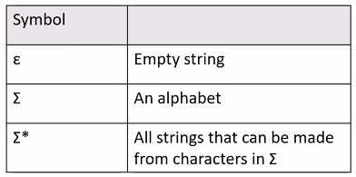

  * Note : 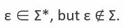

* Relations

  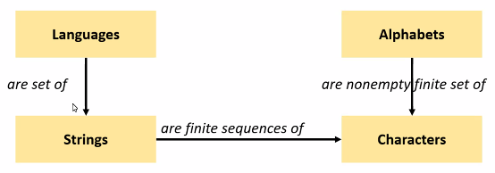

  > Characters are individual symbols

* FA and Languages

  * Let A be an automaton that processes strings drawn from an alphabet ∑

  * The language of A, denoted L(A), is the set of strings over ∑ that A accepts:

    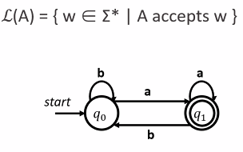

  * A automaton D processes strings over {a, b}

  * Notice that D accepts all strings of a's and b's that end in a and rejects everything else

    * `L(D) = { w ∈ {a,b}* | w ends in a }`
    
    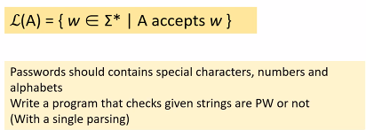

* Formalism

  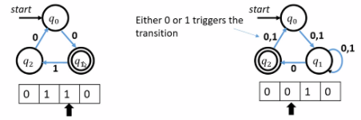

  * In order to reason about the limits of what finite automata can and cannot do, we need to formally specify their behavior in all cases
  * All of the following need to be defined of disallowed
    * What happens if there is no transition out of a state on some input?
    * What happens if there are multiple transitions out of a state on some input?

### DFA

* DFA (Deterministic Finite Automaton) 결정적 유한 오토마타

  * DFAs are the simplest type of automaton

  * A DFA is defined relative to some alphabet ∑
    * For each state in DFA, there must be exactly one transition defined for each symbol in ∑ 
      * => "Deterministic"
      * => A transition function that maps (state, character) ordered pairs to states
      * => For each state in the DFA, there must be exactly one transition defined for each symbol in ∑

  * There is a unique start state

  * There are zero of more accepting states

* Designing DFAs
  * At each point in its execution, the DFA can only remember what state it is in
  * DFA Design Tip : Build each state to correspond to some piece of information you need to remember
    * Each state acts as a "memento" of what you're supposed to do next
  * Only finitely many different states means only finitely many different things the machine can remember => **Finite memory**

* Recognizing Languages with DFAs

  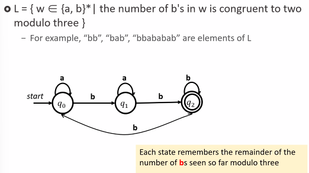

* Finite Automata and Languages

  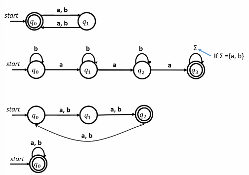

* DFA Design

  * 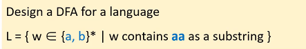

  * 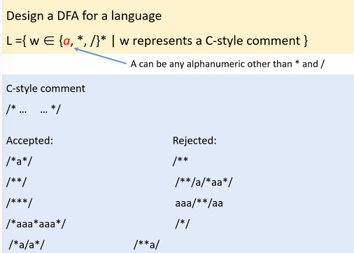

* Tabular DFAs

  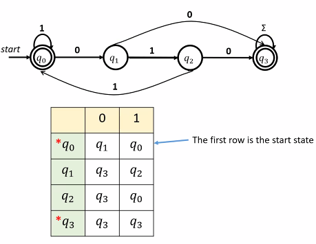

  > accepting state : q0, q3

* DFA as a C program

  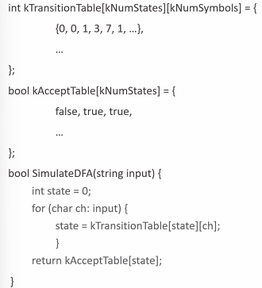

* Language & DFA

  * A language L is called a **regular language (RL)** if there exists a DFA D such that L(D) = L
  * If L is a language and L(D) = L, we say that D **recognizes** language L

* Complement of a Language

  * Given a language `L ⊆  ∑*`, the complement of that language is the language of all strings in  `∑*` that aren't in `L`.

    S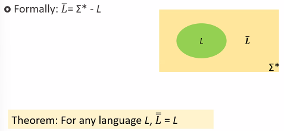

* Complementing Regular Languages

  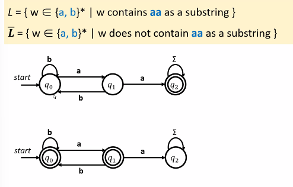

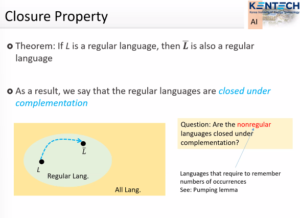

