## NFA

* Nondeterministic Finite Automata
* Structurally similar to a DFA, but represents a fundamental shift in how we'll think about computation

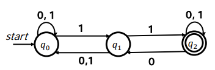

* (Non)determinism
  * A model of computation is deterministic if at every point in the computation, there is exactly one choice that can make
    * The machine accepts if that series of choices leads to an accepting state
  * A model of computation is nondeterministic if the computing machine has a finite number of choices available to make at each point, possibly including zero
  * The machine accepts if any series of choices leads to an accepting state 
    * This sort of nondeterminism is technically called existential nondeterminism

* A simple NFA

  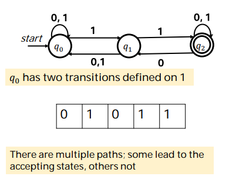

* Another Nondeterminism

  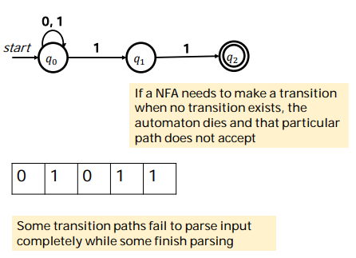

* Language of NFAs

  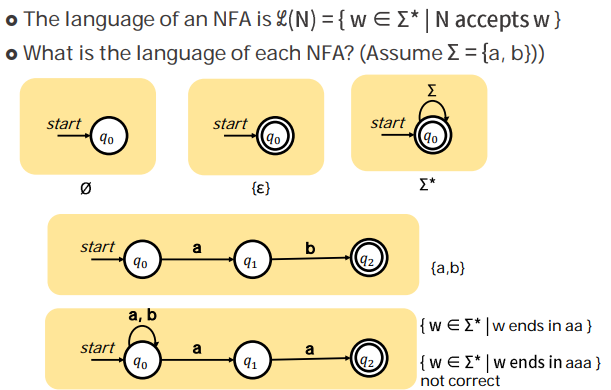

  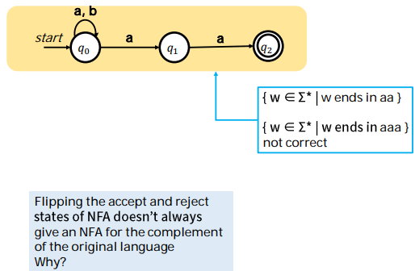

* #### ɛ-Transitions

  * NFAs have special type of transition called the ɛ-transition

  * An NFA may follow any number of ɛ-transitions at any time without consuming any input

    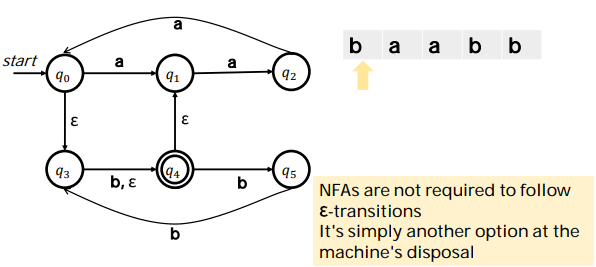

### NFA Intuition

* Intuiting Nondeterminism
  * Nondeterministic machines are a serious departure from physical computers
    * How can we build up an intuition for them?
  * There are two particularly useful frameworks for interpreting nondeterminism: 
    * Perfect positive guessing
    * Massive parallelism

#### - Perfect Positive Guessing

* 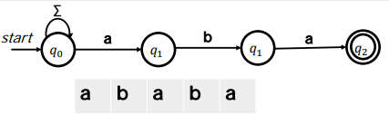
* We can view nondeterministic machines as having Magic Superpowers that enable them to guess choices that lead to an accepting state
  * If there is at least one choice that leads to an accepting state, the machine will guess it
* There is no known way to physically model this intuition of nondeterminism

#### - Massive Parallelism

* 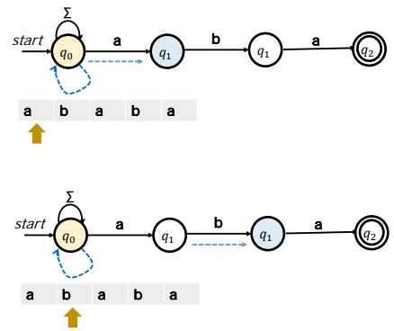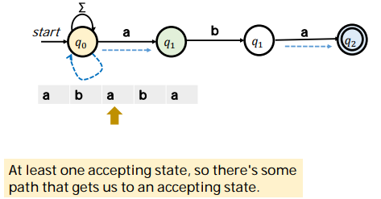
*  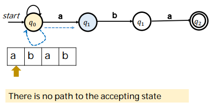
* An NFA can be thought of as a DFA that can be in many states at once
* At each point in time, when the NFA needs to follow a transition, it tries all the options at the same time
* Procedure
  * Start off in the set of all states formed by taking the start state and including each state that can be reached by zero or more - transitions
  * When you read a symbol a in a set of states S: 
    * Form the set S' of states that can be reached by following a single a transition from some state in S
    * Your new set of states is the set of states in S', plus the states reachable from S' by following zero or more ɛ-transitions

### NFA Design

* Designing NFAs
  * Embrace the nondeterminism!
  * Good model: Guess-and-check:
    * Is there some information that you'd really like to have? Have the machine nondeterministically guess that information
    * Then, have the machine deterministically check that the choice was correct
  * The guess phase corresponds to trying lots of different options
  * The check phase corresponds to filtering out bad guesses or wrong options.

#### - Guess-and-check

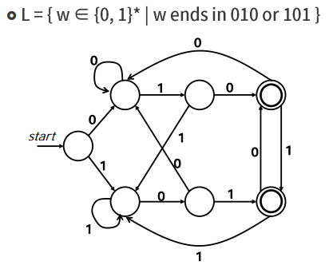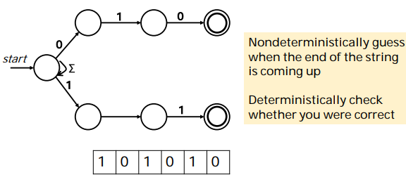

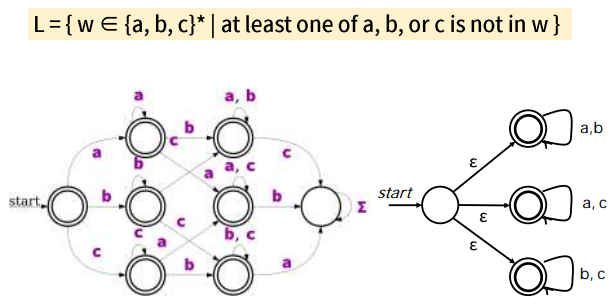

## NFA ≡ DFA ?

#### DFA and NFA

* Any language that can be accepted by a DFA can be accepted by an NFA 
* Why? => Every DFA essentially already is an NFA! 
* How about the reverse?
* Can any language accepted by an NFA also be accepted by a DFA? 
* Surprisingly, the answer is yes! 
* To prove this, we need to:
  * Pick an arbitrary NFA 
  * Describe how we would construct a DFA with the same language (in a generalizable way)

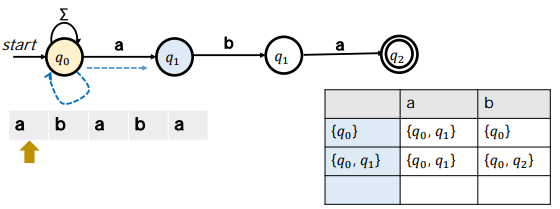

> {q0, q2} | {q0, q1, q2} | {q0}
>
> {q0, q1, q2} | | {q0}

#### The Subset Construction

* This procedure for turning an NFA for a language L into a DFA for a language L is called the subset construction
  * Or powerset construction
* Intuitively:
  * Each state in the DFA corresponds to a set of states from the NFA
  * Each transition in the DFA corresponds to what transitions would be taken in the NFA when using the massive parallel
  * The accepting states in the DFA correspond to which sets of states would be considered accepting in the NFA when using the massive parallel
* Explore more on Subset Construction with elaborate examples involving ɛ-transitions and cases where the NFA dies
* In converting an NFA to a DFA, the DFA's states correspond to sets of NFA states
* Useful fact: |℘(S)| = 2 ^|𝑆| for any finite set S 
  * |𝑆| = N
  * ℘(S) : Power sets from a set S
* In the worst-case, the construction can result in a DFA that is exponentially larger than the original NFA 
* Question to ponder: Can you find a family of languages that have NFAs of size n, but no DFAs of size less than 2 ^|𝑛| ?

#### Important Theorem

* Theorem : A language L is regular if and only if there is some NFA N such that ℒ (N) = L

* Proof
  * → Part is easy 
    * Pick a language L that is regular 
      * That means there's a DFA D where ℒ(D) = L 
      * Every DFA is "basically" and NFA, so there's an NFA (D) whose language is L 
  * ← Part is also easy
    * Next, assume there's an NFA N such that ℒ(N) = L 
    * Using the subset construction, we can build a DFA D where ℒ ( N) = ℒ (D) 
    * Then we have that ℒ (D) = L, so L is regular.

#### Perspectives on RL

* We now have two perspectives on regular languages 
  * Regular languages are languages accepted by DFAs 
  * Regular languages are languages accepted by NFAs 
* We can now reason about the regular languages in two different ways

#### Union of Two Languages

* If L1 and L2 are languages over the alphabet ∑, the language L1 ∪ L2 is the language of all strings in at least one of the two languages
* Question : If L1 and L2 are regular languages, is L1 ∪ L2?
* 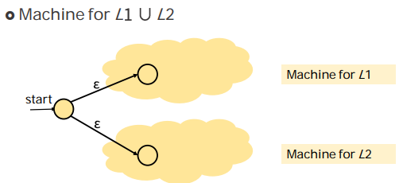

#### Intersection of Two Languages

* If L1 and L2 are languages over ∑, then L1 ∩ L2 is the language of strings both L1 and L2
* Question : If L1 and L2 are regular, is L1 ∩ L2 regular as well?
* 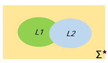

#### String Concatenation

*  If w ∈ ∑* and x ∈ ∑*, the **concatenation** of w and x, denoted wx, is the string formed by tacking all the characters of x onto the end of w 
  * Example: if w = quo and x = kka, the concatenation wx = quokka 
* This is analogous to the + operator for strings in many programming languages 
* Some facts about concatenation: 
  * The empty string ɛ is the identity element for concatenation
    * Wɛ = ɛW = W 
  * Concatenation is associative: wxy = w(xy) = (wx)y

#### Language Concatenation

* The concatenation of two languages L₁ and L₂ over the alphabet ∑ is the language 
  L₁L₂ = { wx ∈ ∑* | w ∈ L₁ ∧ x ∈ L₂ }

  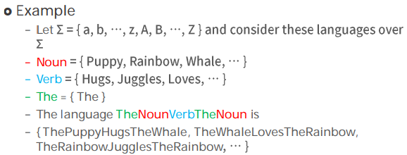

#### Two Perspectives of ConCatenation

* The set of all strings that can be made by concatenating a string in L₁ with a string in L₂ 
* The set of strings that can be split into two pieces: a piece from L₁ and a piece from L₂? 

> This is closely related to, but different than, the Cartesian product. 
> Question to ponder: In what ways are concatenations similar to Cartesian products? In what ways are they different?

#### Concatenating Regular Languages

* If L1 and L2 are regular languages, is L1L2?

* Intuition - can we split a string w into two strings xy such that x ∈ L1 and y ∈ L2?

  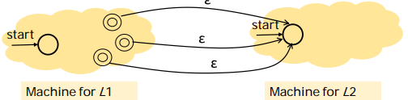

* Idea

  * Run a DFA/NFA for L1 on w.
  * Whenever it reaches an accepting state, optionally hand the rest of w to a DFA/NFA for L2 
  * If the automaton for L2 accepts the rest, w ∈ L₁L₂. 
  * If the automaton for L2 rejects the remainder, the split was incorrect.

#### Concatenation

 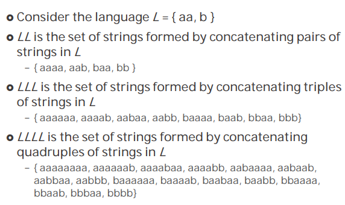

#### Language Exponentiation

* We can define what it means to "exponentiate" a language as follows:

  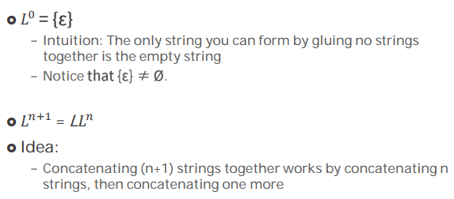

#### The Kleene Closure

 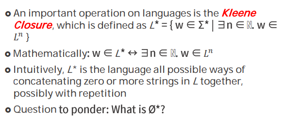

 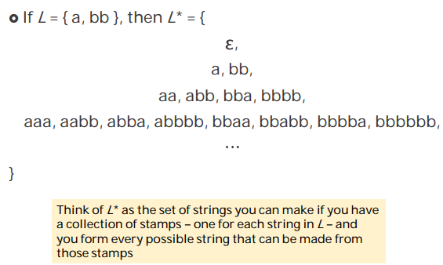

#### Reasoning about Infinity

* If L is regular, is L* necessarily regular?
  * 𝐿0 = {ɛ} is regular
  * 𝐿1 = L is regular 
  * 𝐿2 = LL is regular 
  * 𝐿3 = L(LL) is regular  ...
* Regular languages are closed under union 
* So the union of all these languages is regular.

* Reasoning about Infinite
  * If a series of finite objects all have some property, the "limit" of that process does not necessarily have that property 
  * In general, it is not safe to conclude that some property that always holds in the finite case must hold in the infinite case (This is why calculus is interesting) 
  * So our earlier argument (L* = L0 ∪ L1∪ ...) isn't going to work 
  * We need a different line of reasoning

#### The Kleene Star

* Idea : Can we directly convert an NFA for language L to an NFA for language L*?

  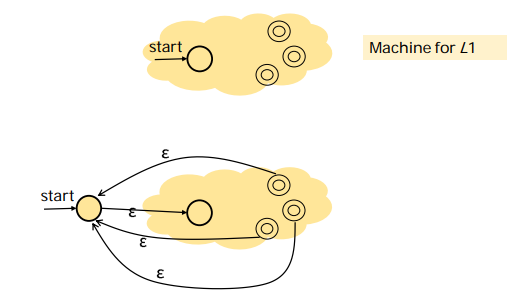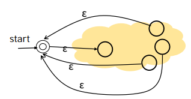

#### Closure Properties

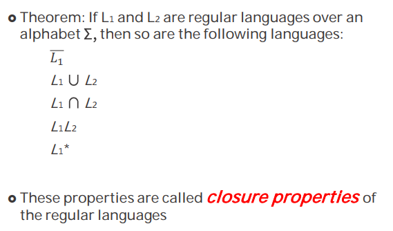
