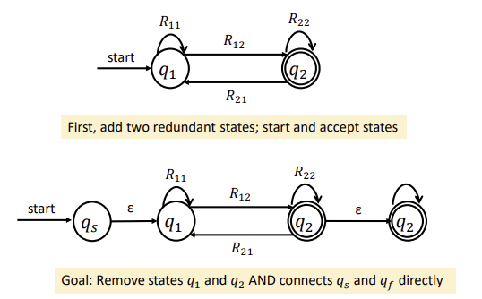
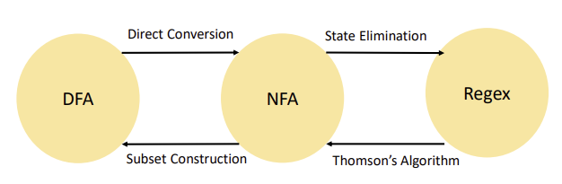

## Regular Expressions 정규표현

* Rethinking Regular Languages
  * We currently have several tools for showing a language L is regular :
    * Construct a DFA for L.
    * Construct an NFA for L
    * Combine several simpler regular languages together via closure properties

* Consider a language L = { w contains aa as a substrings }
  * Difficult to manipulate with verbal descriptions
* Regular Expressions are a way of describing a language via a string representation
  * Easy to apply language operators
  * Shortened to **regex**
* Wide applicability
  * JavaScript : for data validation
  * UNIX grep and flex tools : search files and build compilers
  * Used to clean and scrape data for largescale analysis projects.
* Conceptually, regular expressions are strings describing how to assemble a larger language out of smaller pieces.

* Important Symbols
  * R^n = RR...R (n번 반복)
    * R^0 = ɛ
  * ∑ = any character in ∑
  * R? = R ∪ ɛ = 0개 이상
  * R⁺ = RR* = 1개 이상

### Language from Regex and RL

* Regular Languages(RL) = Language you can build a DFA / NFA for
* Languages(RGL) = Language you can write a Regex for

### NFA to Regex

* The State-Elimination Algorithm

  * To eliminate a state q from the automaton, do the following for each pair of states q₀ and q₁, where there's a transition from q₀ into q and a transition from q into q₁: 
    * Let Rin be the regex on the transition from q₀ to q 
    * Let Rout be the regex on the transition from q to q₁ 
    * If there is a regular expression Rstay on a transition from q to itself, add a new transition from q₀ to q₁ labeled ((Rin)(Rstay )*(Rout )).
    *  If there isn't, add a new transition from q₀ to q₁ labeled ((Rin)(Rout))

  > q₀ -Rin-> q -Rout-> q₁ : q 제거 => q₀ ->q₁에 Rin+Rout + (Rin)(Rstay)*(Rout) 추가

* Transformation

  

* Equivalences
  * Theorem: The following are all equivalent: 
    * L is a regular language 
    * There is a DFA D such that ℒ(D) = L 
    * There is an NFA N such that ℒ(N) = L 
    * There is a regular expression R such that ℒ(R) = L 
  * The equivalence of regular expressions and finite automata has practical relevance
    * Regular expression matchers have all the power available to them of DFAs and NFAs
